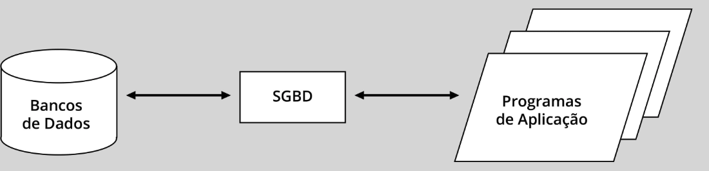

## DEFINIÇÃO

Apresentação da evolução histórica dos bancos de dados, abordando as características dos sistemas de banco de dados `(SBD)` e a arquitetura dos sistemas de gerência de banco de dados `(SGBD)`.

## PROPÓSITO
Compreender a origem e as características dos `SBDs`, bem como suas funcionalidades, vantagens e desvantagens, além de conhecer a arquitetura dos `SGBDs` e os sistemas mais utilizados em bancos de dados.


# Objectivos

## Módulo 1
Reconhecer o histórico dos bancos de dados e suas tecnologias

## Módulo 2
Identificar as características dos sistemas de banco de dados (SBD)

## Módulo 3
Descrever a arquitetura dos sistemas de gerência de banco de dados (SGBD)


### Introdução (vídeo) - anotações

```txt
Dado é um fato em sua forma primária (5kg de arroz, 50 reais, etc.)
Informação é um dado processado, que leva a um conhecimento produzido.
Dados (fato em forma primária) -> Processamento -> Informação (conhecimento produzido)
Conhecimento - conhecer padrões
Dados -> Informação -> Conhecimento -> Criatividade
Banco de dados não surgiu com informática (arquivos de pastas eram banco de dados)
O que é um banco de dados?
```


# Módulo 1

## DEFINIÇÃO DE BANCO DE DADOS

Você certamente já leu sobre o termo `banco de dados` em algum contexto técnico ou geral na mídia tradicional ou na internet.

Mas o que é um banco de dados?

O termo banco de dados, no sentido técnico, origina-se de database, do inglês, e o livro-texto de edição norte-americana mais adotado no mundo o define de maneira simples e direta: “banco de dados é uma coleção de dados relacionados” (ELMASRI; NAVATHE, 2019), em que dados são `fatos conhecidos que podem ser registrados e possuem significado implícito`.

Exemplo: Nome, data de nascimento, endereço e telefone são dados relacionados entre si, inerentes a uma pessoa conhecida em certo contexto. Antes de elaboramos mais essa definição, vamos relembrar um pouco da história dos bancos de dados.

O conceito de banco de dados como uma coleção de dados relacionados sempre existiu como componente central dos sistemas de informação. Estes, por sua vez, sempre existiram desde que a humanidade se organizou como sociedade. Segundo afirmam Melo, Silva e Tanaka (1998), o que tem mudado rapidamente ao longo da história é a tecnologia que permite a sua implementação e que se confunde com o próprio conceito de sistemas de informação.

Assim, antes da existência do computador, bancos de dados existiam sob a forma de registros físicos em papel, organizados em pastas dentro de armários, que formavam os arquivos dos sistemas de informação, operados manualmente pelos seus usuários. Será que ainda existem sistemas de informação desse tipo em pleno século XXI?

## EVOLUÇÃO DOS SISTEMAS DE INFORMAÇÃO EM COMPUTADOR

### Era do processamento de dados


#### Charles Babbage

Historicamente, o computador, inventado na década de 1940 ao fim da Segunda Guerra Mundial, era usado primordialmente como uma máquina para cálculos matemáticos complexos, a exemplo da máquina diferencial de Charles Babbage, do século XIX.

Charles Babbage
Charles Babbage (1791-1871) é um dos mais célebres ícones no mundo da computação. As suas notáveis contribuições para a área fizeram dele o pioneiro dos computadores. A Máquina Diferencial N. 1 foi a primeira calculadora automática a ser inventada e ainda é considerada uma peça única pela precisão que na época apresentava.


### John von Neumann

Logo se percebeu que, graças à arquitetura criada pelo seu inventor, John von Neumann, baseada em uma unidade central de processamento que armazena programas e dados, o computador também serve para o processamento de dados e não apenas para cálculos.

Essa utilidade do computador foi impulsionada com a invenção do disco magnético pela IBM, em 1957, que o denominou de Dispositivo de Armazenamento de Acesso Direto (`DASD`, do inglês `Direct Acess Storage Device`).

Fundamentalmente, o que esse dispositivo – atualmente conhecido como disco rígido e pela sigla HD (`Hard Disk`) – apresentou de novidade, à época, foi a capacidade de leitura de dados externos à unidade central de processamento de forma direta, sem a necessidade de leitura sequencial, como em fitas magnéticas.

Com o advento do armazenamento externo em disco rígido, nasceu a era do processamento de dados por computador.

Você já ouviu falar em `Centro de Processamento de Dados` (CPD), denominação que ainda persiste em organizações tradicionais?

Nessa era, os programas de aplicação, desenvolvidos em uma linguagem de programação (usualmente COBOL, em aplicações empresariais, ou Fortran, em aplicações científicas), manipulavam dados armazenados em arquivos hospedados em disco magnético, utilizados pelo sistema operacional e formando o que se denomina `sistema de arquivos`.

A figura a seguir mostra a evolução obtida ao possibilitar que os programas acessassem os dados externamente em arquivos no disco (configurando um avanço em relação aos programas que continham internamente os próprios dados) para execução em lotes (`batch`, em inglês), na fase inicial do uso do computador.


Esse modelo de processamento de dados com sistema de arquivos foi largamente utilizado no início do emprego do computador em sistemas de informação empresariais, após o advento do disco magnético, persistindo até os dias atuais, nos chamados sistemas legados. Exemplo disso, foi a maior demanda por programadores da linguagem COBOL durante a pandemia de COVID-19 para realizar manutenção em sistemas da Administração Pública do governo dos EUA.

## Primórdios dos sistemas de banco de dados

- Seguindo na história, o advento dos bancos de dados foi uma evolução natural dos sistemas de arquivos. Observe na figura anterior que os programas os quais manipulam os arquivos de dados, além de implementarem a lógica da aplicação, têm de conter um módulo para a gerência dos arquivos de dados. Esse módulo deve ser repetido em todos os programas que precisam acessar e manipular o mesmo arquivo de dados.

- Por exemplo, o departamento de pessoal de uma organização mantém o arquivo com os dados dos empregados. Suponha que o departamento de produção também precise usar dados desse arquivo para alocar empregados em projetos. Nesse caso, os programas de aplicação que atendem aos dois departamentos deverão conter o mesmo módulo de gerência do arquivo de empregados, causando uma repetição de código de programação e dificultando a sua manutenção.

- Assim, os `sistemas de banco de dados` (SBD) vieram para mitigar esse problema, a partir de 1960, tirando dos programas de aplicação a responsabilidade de gerenciar os arquivos de dados, tarefa que passou a ser delegada a um software intermediário, denominado de sistema de gerência de banco de dados (SGBD), como mostra a figura a seguir.



Essa propriedade dos sistemas de banco de dados é denominada de `independência entre dados e programas`, uma diferença primordial em relação aos sistemas de arquivos.

Em outras palavras, ocorreu uma modularização do sistema de informação, com a distribuição de responsabilidades entre os programas de aplicação e o SGBD. Os programas de aplicação passaram a se ocupar exclusivamente das funcionalidades da aplicação propriamente dita, deixando as tarefas de acesso e manipulação dos dados armazenados em disco para o SGBD, um software tipicamente auxiliar, de bastidores ou, como se costuma dizer no jargão do mercado, um serviço de `back end`.

Atenção:

Perceba a diferença entre o sistema de banco de dados (SBD) e o sistema de gerência de banco de dados (SGBD), pois o primeiro é mais amplo, englobando o SGBD, os próprios programas de aplicação e os bancos de dados manipulados por eles.

Neste ponto, cabe um questionamento importante, cada vez mais válido em face dos avanços das tecnologias de hardware de memória, tanto de memória principal (RAM) quanto de memória secundária (discos magnéticos ou `hard disk drives` (HDD) e de semicondutores ou `solid state drives` (SSD)).

A questão é: qual dos três modelos de sistemas é o mais eficiente para uma aplicação com o mesmo volume de dados, ou seja, o modelo monolítico com dados junto dos programas; o modelo com sistemas de arquivos; ou o modelo com sistemas de bancos de dados? Adiaremos a resposta a essa questão para o final deste módulo.

## Estágio atual dos sistemas de informação (na Web)

Antes de discorrer sobre o histórico dos SBDs, vale completar a evolução dos sistemas de informação até os dias atuais, fortemente influenciada pela revolução tecnológica causada pela `World Wide Web` no final do século XX.

Com a popularização da interface Web no desenvolvimento das aplicações, surgiram novas linguagens de programação e novas formas de armazenamento e acesso a dados em fontes com diferentes formatos. Assim, o SGBD das aplicações tradicionais pode ser considerado atualmente como um gênero de software básico, com papel intermediário, que denominamos na figura a seguir de `middleware`, em que se incluem servidores de aplicações das diferentes linguagens e ambientes de desenvolvimento Web.


Essa figura resume o atual estágio dos sistemas de informação na Web, em que as fontes de dados não se restringem a dados estruturados, como em bancos de dados tradicionais, admitindo volumes gigantescos em diversos formatos, localizações e velocidade de produção, características marcantes do conceito de `Big Data`. Igualmente, as aplicações via Web são desenvolvidas em uma diversidade de plataformas digitais, de `smartphones` a supercomputadores, que têm em comum a conexão com a internet e, em consequência, a computação em nuvem (`Cloud Computing`).

## EVOLUÇÃO DOS SISTEMAS DE BANCO DE DADOS

### Bancos de dados navegacionais

Há uma controvérsia sobre qual foi o primeiro SGBD implementado e utilizado comercialmente na década de `1960`. Sabe-se que `duas iniciativas independentes ocorreram paralelamente`, resultando em dois produtos comerciais:

**IDS (Integrated Data System)**
Criado por Charles Bachman (1924-2017) no âmbito de um comitê que padronizou a linguagem COBOL (CODASYL, de `Committee on Data Systems Languages`).

**IMS (Information Management System)**
Criado pela IBM na esteira do sucesso da invenção do disco magnético anos antes.

O IDS e o IMS tinham em comum a característica de que os dados eram acessados por meio de programas que “navegam” de registro em registro pela estrutura dos dados armazenados em disco. Por causa dessa característica, atualmente aqueles SGBDs e outros que seguiram a mesma abordagem são denominados de navegacionais.

Observe a `diferença` entre eles:

**IDS**
Usava a estrutura de dados de grafos ou redes, daí a denominação de `network databases`.

**IMS**
Adotava a estrutura de dados de árvores, que é um tipo de grafo mais restrito do que as redes, baseado em hierarquias, originando a denominação `hierarchical databases`.

Vários SGBDs foram implementados com variantes desses modelos de banco de dados, como o DMS (`Data Management System`) e o IDMS (`Integrated Database Management System`). Vale relembrar que muitos sistemas de informação legados daquela época ainda utilizam esses SGBDs navegacionais.


### O modelo relacional de banco de dados

A grande revolução na história dos bancos de dados ocorreu na virada das décadas de 1960 e 1970, com a publicação do artigo seminal do matemático pesquisador da IBM, Edgar Codd, intitulado A Relational Model of Data for Large Shared Data Banks, que introduziu o modelo relacional de banco de dados.

O artigo de Codd, uma das obras mais citadas na comunidade da computação em todos os tempos, foi o marco do chamado modelo relacional de banco de dados, cuja estrutura de dados, diferentemente dos grafos dos bancos de dados navegacionais, é uma função matemática denominada relação.

Codd criou uma Álgebra Relacional e um Cálculo Relacional, nos quais baseou toda a teoria matemática das relações em que fundamentou o modelo relacional. Apesar da base teórica do modelo, a estrutura de dados subjacente tem o mérito de ser muito simples, pois uma relação nada mais é do que uma tabela formada por colunas e linhas, em cujas células estão armazenados os dados, conceito compreensível pelo senso comum de qualquer leigo em Matemática ou computação, como podemos ver a seguir.

| Linhas/Colunas | Nome  | Data de nascimento | Sexo      | Departamento      |
|----------------|-------|--------------------|-----------|-------------------|
| Linha 1        | Jorge | 15/01/1999         | Masculino | Produção          |
| Linha 2        | Ana   | 05/07/1980         | Feminino  | Recursos Humanos  |
| Linha 3        | Joana | 10/09/1990         | Feminino  | Pesquisa          |


A solidez da fundamentação matemática do modelo relacional disparou uma série de iniciativas de implementação em empresas, como a própria IBM, e no meio acadêmico, principalmente nas universidades do estado da Califórnia, onde se localizava o centro de pesquisas da IBM. A partir de então, a IBM patrocinou o projeto `System R` (de _`Relational`_), enquanto a Universidade da Califórnia em Berkeley (UCB) deu início à implementação acadêmica de um SGBD relacional denominado de `Ingres` (_`Interactive Graphics Retrieval System`_).

Principais SGBDs relacionais
O projeto System R deu origem ao SGBD comercial da IBM, inicialmente denominado SQL/DS (Structured Query Language/Data System), depois renomeado de DB2, atualmente um dos líderes no mercado de bancos de dados corporativos, com versões em diferentes plataformas de hardware/software e na nuvem.

Saiba mais
A linguagem SQL, criada pela IBM como uma linguagem de consulta e manipulação de dados dos bancos de dados relacionais, passou a ser conhecida como sinônimo de SGBD relacional, chegando a ser confundida com produtos que levam a sigla em seu nome.

No âmbito comercial, também despontou, como decorrência do sucesso do modelo relacional, o desenvolvimento de um SGBD pela empresa inicialmente denominada Software Development Laboratories (SDL), depois renomeada Relational Software Inc. (RSI) e, finalmente, Oracle Corporation, nome pelo qual é atualmente reconhecido como o SGBD líder do mercado global de banco de dados.

Em 2010, com a aquisição da Sun Microsystems, uma grande empresa de hardware tradicionalmente incentivadora de projetos de software livre, a Oracle incorporou entre seus produtos o MySQL, um SGBD relacional de reconhecida liderança na comunidade de desenvolvimento de sistemas para a Web. O SGBD MySQL, associado ao sistema operacional Linux, ao servidor Web Apache e à linguagem de programação PHP, formou o quarteto de software conhecido pela sigla LAMP, de grande sucesso no desenvolvimento de aplicações Web até os dias atuais.

Na frente acadêmica, o projeto Ingres, da UCB (Universidade da Califórnia, Berkeley) deu origem a versões comunitárias mediante licença livre da própria universidade junto com seu sistema operacional Unix, denominado BSD (`Berkeley Software Distribution`). O projeto acadêmico originou um produto comercial de mesmo nome, Ingres DBMS, que concorreu diretamente com o Oracle e o SQL/DS nos primórdios dos SGBDs relacionais.

O esforço de desenvolvimento do Ingres envolveu muitos pesquisadores, professores e estudantes, os quais acabaram levando o seu código livre em linguagem C para implementação em outros produtos comerciais, notadamente o SGBD Sybase que, na década de 1990, associou-se à Microsoft, dando origem ao SQL Server, atualmente um dos líderes no mercado de bancos de dados relacionais.

A continuidade do projeto Ingres deu frutos também na área acadêmica com a evolução para um modelo de dados além do relacional, estendido com conceitos da programação orientada a objetos, denominado Postgres (de Post Ingres).

Saiba mais
Após a incorporação da linguagem SQL na década de 1990, o Postgres foi rebatizado como PostgreSQL, atualmente reconhecido como o mais avançado SGBD `open source` do mundo. Para saber mais sobre o PostgreSQL, não deixe de verificar a indicação feita no Explore+ ao fim deste tema.

O PostgreSQL e o MySQL são os SGBDs mais utilizados no aprendizado dos bancos de dados relacionais pela sua popularidade e pelo fato de disponibilizarem versões com licença e documentação livres.

**Outros modelos de SGBDs**

No ranking de popularidade dos SGBDs, disponibilizado pelo **DB-Engines** em seu website, destacam-se, entre os que adotam o modelo relacional: Oracle, MySQL, Microsoft SQL Server, PostgreSQL e IBM DB2.

Cabe observar que esse ranking não trata exclusivamente de SGBDs do modelo relacional de dados. Os próprios SGBDs relacionais, mencionados como líderes de mercado, são classificados no ranking como “multimodelos”, porque implementam funcionalidades que vão além do modelo relacional. Vejamos:

ORACLE
Relacional e multimodelo (documentos, grafos e RDF)

MYSQL
Relacional e multimodelo (documentos)

MICROSOFT SQL SERVER
Relacional e multimodelo (documentos e grafos)

POSTGRESQL
Relacional e multimodelo (documentos)

IBM DB2
Relacional e multimodelo (documentos e RDF)

**E o que são esses outros modelos de banco de dados, além do relacional?**

Não resta dúvida de que o modelo relacional se firmou no mundo corporativo, sendo utilizado na grande maioria dos sistemas de informação empresariais pela sua popularidade e robustez dos produtos disponíveis ao longo de décadas de desenvolvimento, bem como pela padronização e pelo uso da linguagem de consulta e manipulação de dados SQL.

Entretanto, existem aplicações em sistemas de informação que requerem muito mais recursos de armazenamento e manipulação de dados do que as tabelas do modelo relacional, em especial aplicações Web e de cunho científico que processam grandes quantidades de dados em formatos diversos, com as atuais tendências como `Big Data, Internet of Things` e `Data Science`.

Assim, vários modelos de banco de dados não relacionais vêm surgindo no mercado, sendo denominados de NoSQL, termo traduzido como “Não SQL” ou “Não somente SQL” (de `Not Only` SQL).

São, de fato, bancos de dados que não adotam o modelo relacional de dados e, portanto, não usam a linguagem SQL, embora alguns possuam implementações do comando SELECT da SQL para fins de compatibilidade de linguagem de consulta com os bancos de dados relacionais.

O estudo de bancos de dados NoSQL está fora do escopo deste tema, constituindo-se em um tema à parte pela diversidade dos seus conceitos e de suas tecnologias.

É importante conhecer a importância dessa tendência dos SGBDs, como demonstra o site **DB-Engines Ranking**, que apresenta mais de uma dúzia de modelos de bancos de dados NoSQL com seus principais produtos, muitos deles multimodelos.


#### Saiba mais
**Confira a lista de multimodelos**

Chave-Valor: Redis, Amazon DynamoDB, Microsoft Azure CosmosDB.
Documentos: MongoDB, Amazon DynamoDB, Microsoft Azure CosmosDB.
Séries temporais: InfluxDB, KDB+, Prometheus.
Grafos: Neo4J, Microsoft Azure CosmosDB, ArangoDB.
Orientado a objetos: InterSystems Caché. Versant Object Database, ObjectStore.
Motores de busca: Elasticsearch, Splunk, Solr.
RDF (Resource Description Framework): Marklogic, Apache Jena, Virtuoso.
Colunar: Cassandra, HBase, Microsoft Azure CosmosDB.
Multivalores: Adabas, UniData/UniVerse, jBASE.
XML nativo: Marklogic, Oracle Berkeley DB, Virtuoso.
Eventos: Event Store, IBM DB2 Event Store, NEventStore.
Conteúdos: JackRabbit, ModeShape.
Navegacional: IMS, IDMS.

#### Comentário

O modelo navegacional é exatamente aquele dos primórdios dos sistemas de banco de dados, da década de 1960, antes do advento do modelo relacional, cujos produtos ainda continuam sendo utilizados, principalmente em sistemas de informação legados daquela época.

Para fechar o módulo, neste vídeo o professor Sidney Ventury aprofundará o conteúdo falando um pouco mais sobre as vantagens que o Banco de Dados trouxe em relação ao antigo sistema de arquivos.