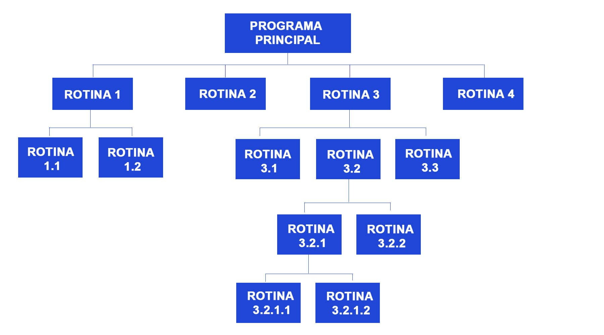
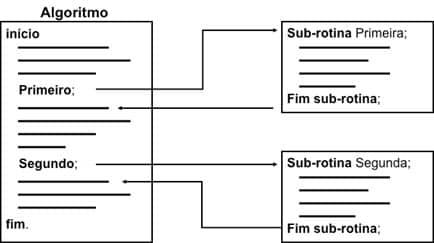
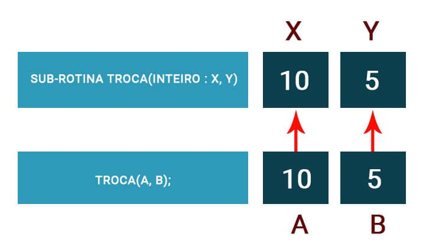

Descrição
Conceitos de análise de algoritmos, os tipos de estruturas de dados homogêneas, heterogêneas e ponteiros, análise da complexidade dos algoritmos, notação O, como avaliar a complexidade dos algoritmos.

PROPÓSITO
Apresentar os conceitos básicos para o entendimento da construção de algoritmos, empregando os tipos de estrutura de dados básicos. Compreender a importância da análise de algoritmos, permitindo a construção de programas com desempenho adequado à necessidade dos usuários. Empregar a notação O e utilizar exemplos práticos para entender a análise de algoritmo.

Preparação
Antes de iniciar o conteúdo deste tema, tenha em mãos um livro de Matemática do ensino médio que apresente os conceitos de funções matemáticas, como função lineares, funções quadráticas, exponenciais e logarítmicas.

## Objetivos

Módulo 1
Definir os conceitos básicos para construção de algoritmos

Módulo 2
Definir as estruturas de dados manipuladas pelos algoritmos

Módulo 3
Definir a notação O e suas aplicações práticas

Módulo 4
Empregar a análise da complexidade dos algoritmos


## Introdução

Algoritmos são a estrutura básica para a criação de soluções para problemas computacionais. A modularização de algoritmos é a principal forma para diminuir a complexidade desses problemas.

Os módulos ou subprogramas passam a tratar partes menores da complexidade do problema, facilitando a compreensão e futuras manutenções que serão necessárias durante o ciclo de vida de um software. A modularização também diminui o retrabalho, pois permite que trechos de códigos sejam reutilizados em outros locais no mesmo sistema.

Após a definição de um algoritmo, é necessário passar por uma otimização. Por mais que, atualmente, os computadores possuam uma capacidade computacional bastante poderosa, principalmente comparando com os recursos computacionais de décadas atrás, a otimização permite que o sistema possa ter um desempenho muito mais adequado, oferecendo ao usuário uma melhor experiência de uso.

A complexidade dos problemas cresceu tão rápido quanto a capacidade computacional, portanto é fundamental a capacidade de analisar diversos algoritmos para um problema complexo para se chegar ao algoritmo mais otimizado para o problema. Um algoritmo otimizado deverá executar em um menor espaço de tempo possível ocupando o menor espaço possível de memória.

Apresentaremos na introdução do Módulo 1 a construção de algoritmos com suas respectivas estruturas de dados utilizadas, os conceitos de análise de algoritmos, explicando como analisar o pior caso de um algoritmo e se chegar a uma ordenação dos algoritmos para a solução de um determinado problema.

# MÓDULO 1
Definir os conceitos básicos para construção de algoritmos

## Introdução

Segundo _Forbellone e Eberspacher (2005)_, um problema matemático é tão mais complexo quanto maior for a quantidade de variáveis a serem tratadas, enquanto um problema algorítmico é tão mais complexo quanto maior for a quantidade de situações diferentes que precisam ser tratadas.

#### Saiba mais
Um algoritmo é base de tudo que é programado para um computador e pode ser definido como uma sequência finita de etapas, perfeitamente definidas, que é utilizada para solucionar um problema.

Cada algoritmo tem uma complexidade que está intimamente associada à complexidade do problema a ser resolvida. Quanto maior for a variedade de situações a serem tratadas, maior será a complexidade.

---

A complexidade pode ser reduzida, reduzindo-se a variedade. E a variedade pode ser reduzida, dividindo problemas maiores em problemas menores. Os problemas menores são tratados através do emprego de sub-rotinas, que terão complexidade menor e poderão ser implementadas de uma forma mais fácil.

Uma técnica que será estudada para a decomposição de problemas é conhecida como top-down, a qual será estudada mais adiante, e que irá definir as sub-rotinas que devem ser criadas para a resolução dos problemas.

Sub-rotinas
Sub-rotinas, também chamadas de subprogramas, são blocos de instruções que realizam tarefas específicas. É um trecho de programa com atribuições específicas, simplificando o entendimento do programa principal, proporcionando ao programa menores chances de erro e de complexidade. Elas são utilizadas para diminuir a complexidade de problemas complexos.

Os programas, de acordo com Ascêncio (2012), tendem a ficar menores e mais organizados, uma vez que o problema pode ser subdivido em pequenas tarefas. Em resumo, são pequenos programas para resolver um problema bem específico. Uma sub-rotina não deve ser escrita para resolver muitos problemas, senão ela acabará perdendo o seu propósito.

##### Uma sub-rotina possui os seguintes objetivos:

- Dividir e estruturar um algoritmo em partes logicamente coerentes.
- Facilitar em testar os trechos em separado.
- Aumentar a legibilidade de um programa.
- Evitar que uma certa sequência de comandos necessária em vários locais de um programa tenha que ser escrita repetidamente nestes locais, diminuindo também, o código fonte.

O programador poderá criar sua própria biblioteca de funções, tornando sua programação mais eficiente, uma vez que poderá fazer uso de funções por ele escritas em vários outros programas com a vantagem de já terem sido testadas.

##### Uma sub-rotina possui as seguintes vantagens:

- Clareza e legibilidade no algoritmo.
- Construção independente.
- Testes individualizados.
- Simplificação da manutenção.
- Reaproveitamento de algoritmos.


## Decomposição de problemas

Um método adequado para realizar a decomposição de problemas é trabalhar com o conceito de *programação estruturada*, pois a maior parte das linguagens de programação utilizadas atualmente também são adequadas a este tipo de paradigma, o que facilita a aplicação deste processo de trabalho. O método mais adequado para aplicar a técnica de decomposição de problemas é o *top-down*, segundo _Manzano e Oliveira (2016)_.

Este método permite que o programa tenha uma estrutura semelhante a um organograma.

A figura abaixo mostra um exemplo da estrutura top-down:

A utilização do método top-down permite que seja realizada uma divisão de problemas em refinamentos sucessivos, da seguinte forma:


## Declaração

Uma sub-rotina é um bloco contendo início e fim, sendo identificada por um nome, pelo qual será referenciada em qualquer parte e em qualquer momento do programa.

Como uma sub-rotina é um programa, ela poderá efetuar diversas operações computacionais, como entrada, processamento e saída, da mesma forma que são executadas em um programa.

A sintaxe genérica de uma sub-rotina é a seguinte:

```plaintext
sub-rotina < nome_da_sub-rotina > [(tipo dos parâmetros : < sequência de declarações de parâmetros >)] : < tipo de retorno >

var
    < declaração de variáveis locais >;
Início
    comandos que formam o corpo da sub-rotina
  retorne(< valor >) ; /* ou retorne; ou nada */
Fim sub-rotina
```


A declaração da sub-rotina deve estar entre o final da declaração de variáveis e a linha de início do programa principal.

Segue, abaixo, um exemplo de um algoritmo para somar dois números inteiros.


```plaintext
Algoritmo somaInteiros;
var
    n, m: inteiro;
//declaração de sub-rotina
sub-rotina soma(inteiro: a,b): inteiro
var
    resultado: inteiro;
início
    resultado <- a + b;
retorne resultado;
fim sub-rotina
início
    n <- 8;
    m <- 4;
    escreva(soma(n, m)); //chamada da sub-rotina (soma)
fim Algoritmo.
```

## Chamada de sub-rotina

Uma sub-rotina pode ser acionada de qualquer ponto do algoritmo principal ou de outra sub-rotina. O acionamento de uma sub-rotina é conhecido por chamada ou ativação.

Quando ocorre uma chamada, o fluxo de controle é desviado para a sub-rotina, quando ela é ativada no algoritmo principal. Ao terminar a execução dos comandos da sub-rotina, o fluxo de controle retorna ao comando seguinte àquele onde ela foi ativada, exatamente conforme o seguinte algoritmo:

```plaintext
algoritmo()
{...
...
< chamada da sub-rotina >
...
...
}
sub-rotina(...)
{ ...
retorne(...);
}
```


Pode ocorrer que um algoritmo tenha mais de uma sub-rotina. Desta forma, teremos várias chamadas a partir do programa principal a cada uma das sub-rotinas.

### Exemplo

O exemplo abaixo mostra um algoritmo com duas sub-rotinas sendo chamadas, veja que o fluxo de execução passa para a sub-rotina chamada (primeira sub-rotina). Ao final da execução da primeira sub-rotina, o controle retorna para o programa principal.

O mesmo procedimento ocorre com a chamada para a segunda sub-rotina, ao final da execução o controle retorna para o programa principal que segue o seu fluxo normal de execução, conforme a figura:



## Parametrização de sub-rotinas

É possível tornar uma sub-rotina mais genérica e, portanto, mais reutilizável. Isso pode ser feito através da utilização de parâmetros. Parâmetros são os valores que uma sub-rotina pode receber antes de iniciar a sua execução.

##### Comentário
A ativação do módulo precisa indicar os argumentos (valores constantes ou variáveis que serão passados para a sub-rotina). E a passagem dos valores ocorre a partir da correspondência (ordem) argumento X parâmetro.


Podemos ter, por exemplo, uma sub-rotina para exibir a tabuada de oito. Essa sub-rotina poderia ser mais genérica caso fosse possível exibir a tabuada de qualquer número utilizando um parâmetro. Desta forma, a sub-rotina poderia ser executada para calcular a tabuada de qualquer valor passado como parâmetro.

O exemplo abaixo utiliza o conceito de parâmetros para trocar o valor de dois números recebidos como parâmetros.

```plaintext

Algoritmo trocaValores;
var
    a, b : inteiro;
//declaração de sub-rotina
sub-rotina troca(inteiro : x, y)
var
    auxiliar: inteiro;
início
    auxiliar <- x;
    x <- y;
    y <- auxiliar;
    escreva(´valor de a: ´, x, ´valor de b:´, y);
fim sub-rotina
inicio
    a <- 10;
    b <- 5;
    troca (a, b); //chamada da sub-rotina
fim Algoritmo.
```

No algoritmo acima, a definição da sub-rotina é feita das linhas 05 a 13 e a chamada de função é realizada na linha 17.

Os valores das variáveis a e b são passados na sequência para as variáveis x e y na sub-rotina troca (inteiro : x, y), ou seja, o valor da variável a é passado por valor para a variável x, enquanto que o valor da variável b também é passado por valor para a variável y.

