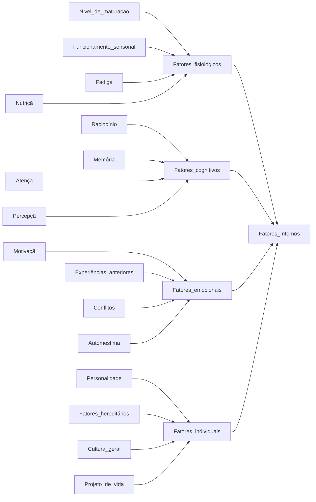
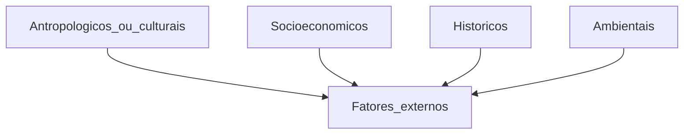
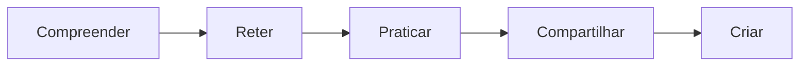

# How to learn better

## Introduction
### The act of learn is fundamental for the human being. Therefore, we'll begin to  better understand the learning and and some of its components. We'll know the internal and external factors that can make it easier, make it difficult or even prevent you from learning.

## Learning concept
### Aprendizagem é o processo pelo qual uma atividade tem origem ou é modificada pela reação a uma situação encontrada, desde que as características da mudança de atividade não possam ser explicadas por tendências inatas de respostas, maturação ou estados temporários do organismo (por exemplo, fadiga, drogas etc.)

### Learning is a process which an activity has origin or is modified by the reaction to a situation found, if the characteristics of the change of activity can not be explained by trends of responses, maturity or temporary states of the organism (for example, fatigue, drugs etc.)

### Thus, every time we find something that stimulates our curiosity and our desire to know, several internal processes are activated so that this situation or object are known so that we can learn about it.

## The internal/personal factors:

## The external/context factors:

## The five steps of learning:

- 1ª Etapa - Compreender: Momento em que uma informação ou conteúdo novo é captada pelo individuo. Normalmente o fato de a informação ser inédita ou desconhecida faz com que a motivação seja despertada. Essas informações podem ser captadas por vários meios, como aulas, leituras, mídias ou até mesmo pela observação da realidade..
- 2ª Etapa - Reter: Referente à fixação das informações obtidas. Nesse momento, percebemos por vezes que não houve retenção de tanto conteúdo como se esperava. Por isso, realizar algumas revisões do que foi visto ou estudado pode dar conta do que se perdeu ou não foi retido.
- 3ª Praticar - Reter: Só temos certeza de que o conteúdo captado foi realmente retido quando conseguimos aplicá-lo a
