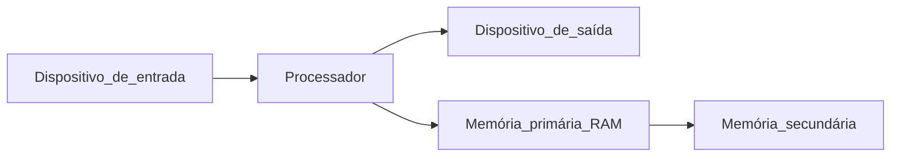

# Evolução histórica dos computadores

## Pré-história
- Máquina Baggage (também conhecida como moinho)
Era mecânica mas era possível programar
- Máquina Pascalina (de pascal)
Através de engrenagens executava cálculos

## 1946 - Primeira geração - Era eletrônica
Surgimento das válvulas eletrônicas
- ENIAC - O primeiro computador digital
- Manch Mark 1 - Foi o primeiro a utilizar Arquitetura Von Neumann
Armazenamento da instrução e dados em memória. Facilitando o processamento dos dados.
Armazenar o programa em memória.

## 1957 - Segunda geração
- Evolução da programação
- Surgimento dos transistores e semicondutores
- Melhora no consumo de energia
- Diminuição do tamanho dos computadores

## 1964 - Terceira geração
- UC (unidade de controle / processadores) - Microprogramação
- Circuitos integrados

## 1970 - Quarta geração
- Microprocessadores
- Evolução do hardware e software
- Computadores pessoais

# Organização funcional do computador

## Arquitetura de John von Neumann
- Memória
  - Unidade de controle
  - Unidade Aritmética e Lógica
    - Acumulador
      - Entrada
      - Saída
## Barramento (BUS)
Os componentes eletrônicos de um computador se comunam através de barramentos.
Barramento: conjunto de fios que conduzem sinais elétricos entre os diversos componentes do computador:
- Barramento de dados
- Barramento de endereço
- Barramento de sinais de controle
Informar ação, ex.: leitura e escrita

- Processador
- Memória cache
- Memória Principal
- E/S
- E/S
- E/S
...
Detalhe barramento -> Fios individuais