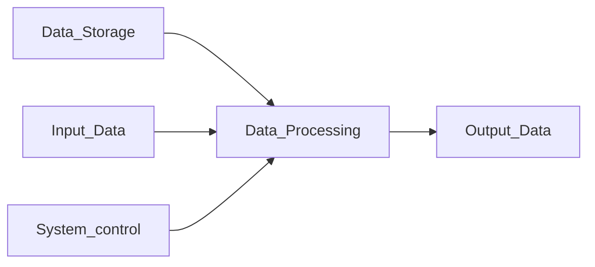

## Information System components:

- User
- Software
- Hardware
- Data
- Network

## Components of information systems

```mermaid
graph LR;
    Data_Storage-->Data_Processing
    Input_Data-->Data_Processing-->Output_Data;
    System_control-->Data_Processing
```

## Main elements of information systems (SI):

### Human resources
