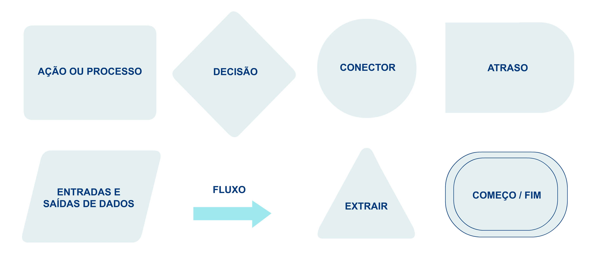

# Ferramentas de soluções

Ao final deste módulo, você será capaz de distinguir o uso de algumas ferramentas para a representação de soluções.

Sabemos que os computadores são muito bons em executar tarefas, e se organizarmos nossas soluções em passos e condições lógicas, os computadores poderão ser instruídos a segui-los e encontrar respostas de forma rápida e precisa. Dessa forma, vamos aprender, neste módulo, um pouco mais sobre algoritmos e fluxogramas, dois conceitos importantes que vão facilitar a nossa vida com os computadores.

Como já vimos, algoritmos são procedimentos para resolver um problema com as ações a serem executadas e a ordem em que elas devem acontecer. Um exemplo bem fácil de identificar é a receita para preparação de um macarrão instantâneo:

1. Ferver 500 ml de água;
2. Colocar o macarrão na água fervente;
3. Esperar 3 minutos;
4. Retirar o macarrão da água;
5. Colocar o tempero;
6. Misturar bem.
7. Servir.

Neste caso, fizemos uma sucessão de passos simples, sem nos preocupar com verificações que poderiam ser feitas para aumentar o nível de detalhamento. Poderíamos, por exemplo, acrescentar a verificação se o gás está chegando adequadamente ao fogão. Poderíamos, também, verificar se o macarrão realmente está pronto após os 3 minutos. É possível fazer várias adaptações para aumentar o nível de detalhamento. Mas a ideia principal é criar uma sequência de passos que oriente a execução da tarefa. Vamos observar outro exemplo simples sobre divisibilidade. 

## Exemplo

O critério para verificar se um número é par ou não é ser divisível por 2. Poderíamos pensar que ser divisível significa ter resto zero na divisão. Logo, um possível algoritmo para responder a um amigo se o número que ele falou é divisível por 2 ou não vem a seguir:

• Perguntar ao seu amigo o número que ele quer testar;

• Ouvir a resposta dele;

• Calcular o resto da divisão do número informado por 2;

• Se o resto da divisão do número informado por 2 for zero, então: responder ao amigo que o número é par;

• Se não for: responder ao amigo que o número é ímpar.

Um algoritmo que esteja organizado, como o exemplo que acabamos de ver, já está bem próximo do que precisamos fazer para instruir corretamente um computador a executar a tarefa.

## Fluxograma

O fluxograma é outra ferramenta bem útil para a representação de uma solução, e pode ser entendido como a representação gráfica de um algoritmo. É como se pudéssemos fazer um esquema, com regras simples, que represente a sequência de passos e condições que compõem um algoritmo. Fluxogramas também podem ser usados para representar sistemas ou processos. Existem diversas ferramentas para a criação de fluxogramas, tanto locais como on-line. Podemos citar o Bizagi. Porém, até mesmo usando o Microsoft Word ou o Microsoft Powerpoint é possível criar fluxogramas.

Para utilizar corretamente o fluxograma, é necessário entender os seus principais componentes:

<!-- image path ./assets/fluxograma_1.jpg -->
<!-- show the image -->

