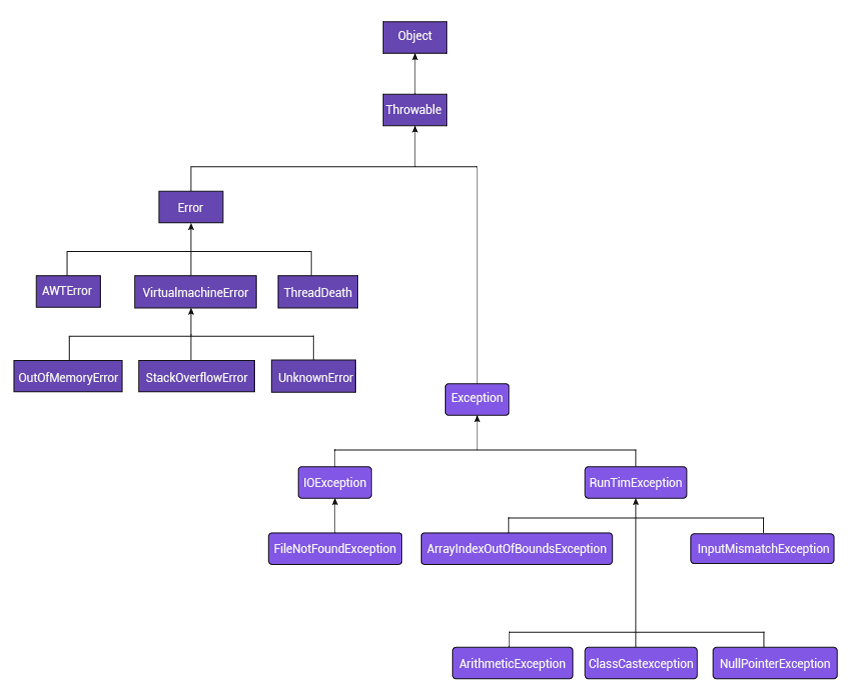

## Implementação de tratamento de exceções em Java


A linguagem Java surgiu com a intenção de facilitar o desenvolvimento de software. É essencial entender, contudo, que essa facilitação tem alcance muito mais amplo do que o conforto do programador. Operações indevidas no código de um programa, como uma divisão por zero, são um caminho para exploração de falhas de segurança.

Assista ao vídeo e entenda que a exceção é um erro em tempo de execução, que não pode ser previsto e evitado por código. Você verá que Java implementa mecanismos de tratamento de exceção e as principais estruturas sintáticas usadas para isso.


Uma exceção é uma condição causada por um erro em tempo de execução que interrompe o fluxo normal de execução. Esse tipo de erro pode ter muitas causas, como uma divisão por zero.

Acompanhe a seguir como funciona os mecanismos de tratamento de exceção implementados por Java.

- Quando uma exceção ocorre em Java, é criado um objeto, chamado de exception object, que contém informações sobre o erro, seu tipo e o estado do programa quando o erro ocorreu. Após ser criado, esse objeto é entregue para o sistema de execução da Máquina Virtual Java (MVJ), processo chamado de lançamento de exceção.
- Quando a exceção é lançada por um método, o sistema de execução vai procurar na pilha de chamadas (call stack) um método que contenha um código para tratar essa exceção. O bloco de código que tem por finalidade tratar uma exceção é chamado de exception handler (tratador de exceções).
- A busca seguirá até que o sistema de execução da MVJ encontre um exception handler adequado para tratar a exceção, passando-a para ele. Quando isso ocorre, é verificado se o tipo do objeto de exceção lançado é o mesmo que o tratador pode solucionar. Se for, ele é considerado apropriado para aquela exceção. Quando o tratador de exceção recebe uma exceção para tratar, diz-se que ele captura (catch) a exceção.
- Quando fornece um código capaz de lidar com a exceção ocorrida, o programador tem a possibilidade de evitar que o programa seja interrompido. Contudo, se nenhum tratador de exceção apropriado for localizado pelo sistema de execução da MVJ, o programa será terminado.

Um bloco monitorado para o lançamento de exceção tem a forma geral mostrada no código 1. Repare que múltiplos blocos catch podem ser encadeados.

```java
try {
//bloco de código monitorado
} 
catch ( ExcecaoTipo1 Obj) {
//tratador de exceção para o tipo 1
}
catch ( ExcecaoTipo2 Obj) {
//tratador de exceção para o tipo 2
}
...//“n” blocos catch
finally {
// bloco de código a ser executado após o fim da execução do bloco “try”
} 
```

Embora o uso de exceções não seja a única forma de se lidar com erros em software, ela oferece algumas vantagens, como:

    1 - Separar o código destinado ao tratamento de erros do código funcional do software. Isso melhora a organização e contribui para facilitar a depuração do código.
    2 - Propagar o erro para cima na pilha de chamadas, entregando o objeto da exceção diretamente ao método que tem interesse na sua ocorrência. Tradicionalmente, o código de erro teria de ser propagado método a método, aumentando a complexidade do código.
    3 - Agrupar e diferenciar os tipos de erros. Java trata as exceções lançadas como objetos que, naturalmente, podem ser classificados com base na hierarquia de classes. Por exemplo, erros definidos mais abaixo na hierarquia são mais específicos, ao contrário dos que se encontram mais próximos do topo, seguindo o princípio da especialização/generalização da programação orientada a objetos.


## Classificando as exceções em Java


Em Java todos os objetos derivam de um ancestral comum, a classe Object. Incluem-se aí as exceções e todas as suas especializações. Entender essa arquitetura de classes é importante para empregar adequadamente o mecanismo de tratamento de exceções.

Assista ao vídeo e compreenda a hierarquia de classes utilizadas em Java para realizar o tratamento de exceções, assim como as exceções implícitas e explicitas.



A primeira separação feita agrupa as exceções em dois subtipos. Vamos conhecê-los!

- Error
  - Agrupa as exceções que, em situações normais, não precisam ser capturadas pelo programa. Um estouro de pilha (stack overflow) é um exemplo de exceção que pertence ao subtipo Error. Em situações normais, não se espera que o programa cause esse tipo de erro, mas ele pode ocorrer e, nesse caso, provoca uma falha catastrófica. Veja que esse erro ocorre durante a execução do software. Os erros que acontecem em tempo de execução são os que a classe Error agrupa. Ela é utilizada para o sistema de execução Java indicar erros relacionados ao ambiente de execução.
- Exception
  - Agrupa as exceções que os programas deverão capturar e permite a extensão pelo programador para criar suas próprias exceções. Uma importante subclasse de Exception é a classe RuntimeException, que corresponde às exceções como a divisão por zero ou o acesso a índice inválido de array e que são automaticamente definidas.

Quando uma exceção não é adequadamente capturada e tratada, o interpretador mostrará uma mensagem de erro com informações sobre o problema ocorrido e encerrará o programa. Vejamos o exemplo mostrado no código 2.

```java
    public class Principal {
        public static void main ( String args [ ] ) throws InterruptedException {
            int divisor , dividendo , quociente = 0;
            String controle = "s";
	        
            Scanner s = new Scanner ( System.in );
            do {    
                System.out.println ( "Entre com o dividendo." );
                dividendo = s.nextInt();
                System.out.println ( "Entre com o divisor." );
                divisor = s.nextInt();
                quociente = dividendo / divisor;
                System.out.println ( "O quociente é: " + quociente );
                System.out.println ( "Repetir?" );
                controle = s.next().toString();
            } while ( controle.equals( "s" ) );
            s.close();
    }    
} 
```

A execução desse código é sujeita a erros ocasionados na execução. Nas condições normais, o programa executará indefinidamente até que escolhamos um valor diferente de “s” para a pergunta “Repetir?”. Um dos erros a que ele está sujeito é a divisão por zero. Como não estamos tratando essa exceção, se ela ocorrer teremos o fim do programa. Observe!

```java
Entre com o dividendo.
10
Entre com o divisor.
0
Exception in thread "main" java.lang.ArithmeticException: / by zero
    at com.mycompany.teste.Principal.main(Principal.java:26)
Command execution failed.
org.apache.commons.exec.ExecuteException: Process exited with an error: 1 (Exit value: 1)
        at org.apache.commons.exec.DefaultExecutor.executeInternal (DefaultExecutor.java:404)
        at org.apache.commons.exec.DefaultExecutor.execute (DefaultExecutor.java:166)
        at org.codehaus.mojo.exec.ExecMojo.executeCommandLine (ExecMojo.java:982)
        at org.codehaus.mojo.exec.ExecMojo.executeCommandLine (ExecMojo.java:929)
        at org.codehaus.mojo.exec.ExecMojo.execute (ExecMojo.java:457)
        at org.apache.maven.plugin.DefaultBuildPluginManager.executeMojo (DefaultBuildPluginManager.java:137)
        at org.apache.maven.lifecycle.internal.MojoExecutor.execute (MojoExecutor.java:210)
        at org.apache.maven.lifecycle.internal.MojoExecutor.execute (MojoExecutor.java:156)
        at org.apache.maven.lifecycle.internal.MojoExecutor.execute (MojoExecutor.java:148)
        at org.apache.maven.lifecycle.internal.LifecycleModuleBuilder.buildProject (LifecycleModuleBuilder.java:117)
        at org.apache.maven.lifecycle.internal.LifecycleModuleBuilder.buildProject (LifecycleModuleBuilder.java:81)
        at org.apache.maven.lifecycle.internal.builder.singlethreaded.SingleThreadedBuilder.build (SingleThreadedBuilder.java:56)
        at org.apache.maven.lifecycle.internal.LifecycleStarter.execute (LifecycleStarter.java:128)
        at org.apache.maven.DefaultMaven.doExecute (DefaultMaven.java:305)
        at org.apache.maven.DefaultMaven.doExecute (DefaultMaven.java:192)
        at org.apache.maven.DefaultMaven.execute (DefaultMaven.java:105)
        at org.apache.maven.cli.MavenCli.execute (MavenCli.java:957)
        at org.apache.maven.cli.MavenCli.doMain (MavenCli.java:289)
        at org.apache.maven.cli.MavenCli.main (MavenCli.java:193)
        at jdk.internal.reflect.NativeMethodAccessorImpl.invoke0 (Native Method)
        at jdk.internal.reflect.NativeMethodAccessorImpl.invoke (NativeMethodAccessorImpl.java:64)
        at jdk.internal.reflect.DelegatingMethodAccessorImpl.invoke (DelegatingMethodAccessorImpl.java:43)
        at java.lang.reflect.Method.invoke (Method.java:564)
        at org.codehaus.plexus.classworlds.launcher.Launcher.launchEnhanced (Launcher.java:282)
        at org.codehaus.plexus.classworlds.launcher.Launcher.launch (Launcher.java:225)
        at org.codehaus.plexus.classworlds.launcher.Launcher.mainWithExitCode (Launcher.java:406)
        at org.codehaus.plexus.classworlds.launcher.Launcher.main (Launcher.java:347)
------------------------------------------------------------------------
BUILD FAILURE
------------------------------------------------------------------------
Total time:  20.179 s
Finished at: 2021-05-22T14:03:57-03:00
------------------------------------------------------------------------
Failed to execute goal org.codehaus.mojo:exec-maven-plugin:3.0.0:exec (default-cli) on project teste: Command execution failed.: Process exited with an error: 1 (Exit value: 1) -> [Help 1]
	 
To see the full stack trace of the errors, re-run Maven with the -e switch.
Re-run Maven using the -X switch to enable full debug logging.
	 
For more information about the errors and possible solutions, please read the following articles: 
[Help 1] http://cwiki.apache.org/confluence/display/MAVEN/MojoExecutionException
```

Vendo a linha número 42, observamos a mensagem “(...) Process exited with an error (…)”, que indica o término abrupto do programa. Veja agora como a captura e o tratamento da exceção beneficia o programa. Vamos substituir a linha 12 do código 2 pelas instruções mostradas no código 4 a seguir.


```java
    try {
        quociente = dividendo / divisor;
    } catch (Exception e)
	   { 
        System.out.println( "ERRO: Divisão por zero!" );
    }
```

Confira a saída para o código modificado.


```java
Entre com o dividendo.
10
Entre com o divisor.
0
ERRO: Divisão por zero!
O quociente é: 0
Repetir?
s
Entre com o dividendo.
10
Entre com o divisor.
5
O quociente é: 2
Repetir?
n
------------------------------------------------------------------------
BUILD SUCCESS
-----------------------
```


Note que agora o programa foi encerrado de maneira normal, apesar da divisão por zero provocada na linha 4. Quando o erro ocorreu, a exceção foi lançada e capturada pelo bloco catch, como vemos na linha 5. A linha 6 mostrou o valor de “quociente” sendo zero, conforme inicializamos a variável na linha 3 do código 2. Se você tentar compilar o programa sem essa inicialização, verá que sem o bloco try-catch não é gerado erro, mas, quando o utilizamos, o interpretador Java nos obriga a inicializar a variável.

Já compreendemos o essencial do tratamento de erros em Java, então veremos a seguir os tipos de exceções implícitas e explícitas (ORACLE INC., s.d.). Também veremos como declarar novos tipos de exceções.


### Exceções implícitas

Definidas nos subtipos Error e RunTimeException e suas derivadas, são exceções ubíquas, isto é, que podem ocorrer em qualquer parte do programa e normalmente não são causadas diretamente pelo programador. Por essa razão, possuem um tratamento especial e não precisam ser manualmente lançadas.

Verificando o código 2, perceberemos que a divisão por zero não está presente no código. A linha 12 apenas codifica uma operação de divisão. Ela não realiza a divisão que produzirá a exceção, a menos que durante a execução o usuário entre com o valor zero para o divisor, situação em que o Java runtime detecta o erro e lança a exceção ArithmeticException.

Outra exceção implícita: o problema de estouro de memória (OutOfMemoryError) pode acontecer em qualquer momento, com qualquer instrução sendo executada, pois sua causa não é a instrução em si, mas um conjunto de circunstâncias de execução que a causaram. Também são exemplos as exceções NullPointerException e IndexOutOfBoundsException, entre outras.

> As exceções implícitas são lançadas pelo próprio Java Runtime, não sendo necessária a declaração de um método throw para ela. Quando uma exceção desse tipo ocorre, é gerada uma referência implícita para a instância lançada. 


A saída do código 2 mostra o lançamento da exceção que nessa versão não foi tratada, gerando o encerramento anormal do programa.

O código 4 nos mostra um bloco try-catch. Considere suas funções a seguir.

- Bloco try
  - Indica o bloco de código que será monitorado para ocorrência de exceção.
- Bloco catch
  - Captura e trata a exceção. 

Entretanto, mesmo nessa versão modificada o programador não está lançando a exceção, apenas a captura. A exceção continua sendo lançada automaticamente pelo Java Runtime. Cabe dizer, contudo, que não há impedição ao lançamento manual da exceção. Veja agora o código 6, que modifica o código 4, passando a lançar a exceção.

```java
try {
    if ( divisor ==0 )
        throw new ArithmeticException ( "Divisor nulo." );
    quociente = dividendo / divisor;
}
catch (Exception e)
{ 
    System.out.println( "ERRO: Divisão por zero! " + e.getMessage() );
} 
```


Veja a saída produzida pela execução dessa versão modificada:

```java
Entre com o dividendo.
12
Entre com o divisor.
0
ERRO: Divisão por zero! Divisor nulo.
O quociente é: 0
Repetir?
n
------------------------------------------------------------------------
BUILD SUCCESS
------------------------------------------------------------------------ 
```

Apesar de o programador ter a capacidade de lançar manualmente uma exceção, os chamadores do método que realiza o lançamento não são obrigados pelo interpretador a tratar a exceção. Apenas exceções que não são implícitas, isto é, lançadas pelo Java Runtime, devem obrigatoriamente ser tratadas. Por isso também dizemos que exceções implícitas são contornáveis, podemos simplesmente ignorar seu tratamento. Isso, porém, não tende a ser uma boa ideia, já que elas serão lançadas e vão provocar a saída anormal do programa. 


### Exceções explícitas

Todas as exceções que não são implícitas são consideradas explícitas. Esse tipo de exceção, de maneira oposta às implícitas, é considerado incontornável. Quando um método usa uma exceção explícita, ele obrigatoriamente deve usar uma instrução throw no corpo do método para criar e lançar a exceção.

O programador pode escolher não capturar essa exceção e tratá-la no método em que ela é lançada. Ou fazê-lo e ainda assim desejar propagar a exceção para os chamadores do método. Em ambos os casos, deve ser usada uma cláusula throws na assinatura do método que declara o tipo de exceção a ser lançada se um erro ocorrer. Nesse caso, os chamadores precisarão envolver a chamada em um bloco try-catch.

O código 8 mostra um exemplo de exceção explícita (IllegalAccessException). Essa exceção é uma subclasse de ReflectiveOperationException, que, por sua vez, descende da classe Exception. Logo, não pertence aos subtipos Error ou RuntimeException que correspondem às exceções explícitas. 

```java
public class Arranjo {
    int [] vetor = { 1 , 2 , 3, 4 };
    int getElemento ( int i ) {
        try {
            if ( i < 0 || i > 3 )
                throw new IllegalAccessException ();
        } catch ( Exception e ) {
            System.out.println ( "ERRO: índice fora dos limites do vetor." );
        }    
        return vetor [i];
    }
}
```

Como é uma exceção explícita, ela precisa ser tratada em algum momento. No caso mostrado no código 8, essa exceção explícita está abarcada por um bloco try-catch, o que livra os métodos chamadores de terem de lidar com a exceção gerada.

#### Quais seriam as consequências se o programador optasse por não tratar a exceção explícita localmente? 

Resposta

Nesse caso, o bloco try-catch seria omitido com a supressão das linhas 4, 7, 8 e 9. A linha 6, que lança a exceção, teria de permanecer, pois é uma exceção explícita. Ao fazer isso, o interpretador Java obrigaria o acréscimo de uma cláusula throws na assinatura do método, informando aos chamadores as exceções que o método pode lançar. 


```java
public class Chamador {
    Arranjo arrj = new Arranjo ( );
	    
    int invocaGetElemento ( int i ) {
        return arrj.getElemento ( i );
    }
} 
```

A situação, porém, é diferente se o método getElemento ( i ) propagar a exceção por meio de uma cláusula throws. Nesse caso, mesmo que a exceção seja tratada localmente, os chamadores deverão envolver a chamada ao método num bloco try-catch ou também propagar a exceção.


## Declarando novos tipos de exceção

Até o momento, todas as exceções que vimos são providas pela própria API Java. Essas exceções cobrem os principais erros que podem ocorrer num software, como:

- Erros de operações de entrada e saída (E/S)
- Problemas com operações aritméticas
- Operações de acesso de memória ilegais

Adicionalmente, fornecedores de bibliotecas costumam prover suas próprias exceções para cobrir situações particulares de seus programas. Então, no desenvolvimento de um software simples, possivelmente isso deve bastar. Mas nada impede que o programador crie sua própria classe de exceções para lidar com situações específicas.

Assista ao vídeo e conheça os mecanismos da linguagem Java para customizar e criar novos tipos de exceções de acordo com as necessidades do que está sendo implementado.

Ao prover software para ser usado por outros, como bibliotecas, motores ou outros componentes, declarar seu próprio conjunto de exceções é uma boa prática de programação e agrega qualidade ao produto. Felizmente, isso é possível utilizando o mecanismo de herança.

Para criar uma classe de exceção, deve-se obrigatoriamente estender uma classe de exceção existente, pois isso irá legar à nova classe o mecanismo de manipulação de exceções. Uma classe de exceção não possui qualquer membro a não ser os 4 construtores (DEITEL; DEITEL, 2017). Vamos conhecê-los!


- Um que não recebe argumentos e passa uma String — mensagem de erro padrão — para o construtor da superclasse.
- Um que recebe uma String — mensagem de erro personalizada — e a passa para o construtor da superclasse.
- Um que recebe uma String — mensagem de erro personalizada — e um objeto Throwable — para encadeamento de exceções — e os passa para o construtor da superclasse.
- Um que recebe um objeto Throwable — para encadeamento de exceções — e o passa para o construtor da superclasse.

Embora o programador possa estender qualquer classe de exceções, é preciso considerar qual superclasse se adequa melhor à situação.


##### Relembrando
Estamos nos valendo do mecanismo de herança, um importante conceito da programação orientada a objetos.


Em uma hierarquia de herança, os níveis mais altos generalizam comportamentos, enquanto os mais baixos especializam. Logo, a classe mais apropriada será aquela de nível mais baixo cujas exceções ainda representem uma generalização das exceções definidas na nova classe. Em última instância, podemos estender diretamente da classe Throwable.

Como qualquer classe derivada de Throwable, um objeto dessa subclasse conterá um instantâneo da pilha de execução de sua thread no momento em que foi criado. Ele também poderá conter uma String com uma mensagem de erro, como vimos antes, a depender do construtor utilizado. Isso também abre a possibilidade para que o objeto tenha uma referência para outro objeto throwable que tenha causado sua instanciação, caso em que há um encadeamento de exceções.

> Ao se criar uma classe de exceção, deve-se considerar a reescrita do método toString (). Além de fornecer uma descrição para a exceção, essa reescrita permite ajustar as informações que são impressas pela invocação desse método, potencialmente melhorando a legibilidade das informações mostradas na ocorrência das exceções.


```java
public class ErroValidacaoCNPJ extends Throwable {
    private String msg_erro;
	    
    ErroValidacaoCNPJ ( String msg_erro ) {
        this.msg_erro = msg_erro;
    }
	    
    @Override
    public String toString ( ) {
        return "ErroValidacaoCNPJ: " + msg_erro;
    }
}
```

Repare o uso do código 10 nas linhas 22 e 61 da classe Juridica (Código 11). Veja também que a exceção é lançada e encadeada, ficando o tratamento a cargo de quem invoca atualizarID ().

```java
public class Juridica extends Pessoa {
    public Juridica ( String razao_social , Calendar data_criacao, String CNPJ , Endereco endereco , String nacionalidade , String sede ) {
        super ( razao_social , data_criacao, CNPJ , endereco , nacionalidade , sede);        
    }
    @Override
    public boolean atualizarID ( String CNPJ ) throws ErroValidacaoCNPJ {
        if ( validaCNPJ ( CNPJ ) ) {
            this.identificador = CNPJ;
            return true;
        }
        else {
            System.out.println ( "ERRO: CNPJ invalido!" );
            return false;
        }
    }
    private boolean validaCNPJ ( String CNPJ ) throws ErroValidacaoCNPJ {
        char DV13, DV14;
        int soma, num, peso, i, resto;
        //Verifica sequência de dígitos iguais e tamanho (14 dígitos)
        if ( CNPJ.equals("00000000000000") || CNPJ.equals("11111111111111") || CNPJ.equals("22222222222222") || CNPJ.equals("33333333333333") || CNPJ.equals("44444444444444") || CNPJ.equals("55555555555555") || CNPJ.equals("66666666666666") || CNPJ.equals("77777777777777") || CNPJ.equals("88888888888888") || CNPJ.equals("99999999999999") || (CNPJ.length() != 14) )
        {
            throw new ErroValidacaoCNPJ ( "Entrada invalida!" );
            //   return(false);
        }
        try {
            //1º Dígito Verificador
            soma = 0;
            peso = 2;
            for ( i = 11 ; i >= 0 ; i-- ) {
                num = (int)( CNPJ.charAt ( i ) - 48 );
                soma = soma + ( num * peso );
                peso++;
                if ( peso == 10 )
                peso = 2;
            }
            resto = soma % 11;
            if ( ( resto  == 0 ) || ( resto == 1 ) )
                DV13 = '0';
            else
                DV13 = (char)( ( 11 - resto ) + 48 );
            //2º Dígito Verificador
            soma = 0;
            peso = 2;
            for ( i = 12 ; i >= 0 ; i-- ) {
                num = (int) ( CNPJ.charAt ( i ) - 48 );
                soma = soma + ( num * peso );
                peso++;
                if ( peso == 10 )
                peso = 2;
            }
            resto = soma % 11;
            if ( ( resto == 0 ) || ( resto == 1 ) )
                DV14 = '0';
            else
                DV14 = (char) ( ( 11 - resto ) + 48 );
            //Verifica se os DV informados coincidem com os calculados
            if ( ( DV13 == CNPJ.charAt ( 12 ) ) && ( DV14 == CNPJ.charAt ( 13 ) ) )
                return true;
            else
            {
                throw new ErroValidacaoCNPJ ( "DV inválido." );
                //return false;
            }
        } catch (InputMismatchException erro) {
            return false;
        }
    }
    public String retornaTipo ( ) {
        return "Juridica";
    }
}
```

Veja agora a saída:

```
ErroValidacaoCNPJ: Entrada invalida!
------------------------------------------------------------------------
BUILD SUCCESS
------------------------------------------------------------------------
```


## Usando exceções em Java


Apresentaremos agora um caso prático para examinar a utilidade das exceções no desenvolvimento de software, usando o cálculo recursivo do fatorial como exemplo. O sistema é composto por duas classes, a Principal e a Fatorial, e funciona solicitando ao usuário um número para o qual o fatorial será calculado. O programa realiza o cálculo por meio de uma chamada recursiva ao método calcularFatorial() da classe Fatorial, contabilizando quantas chamadas recursivas são feitas. O objetivo do estudo é explorar exceções, forçando duas exceções da classe Error: IOException e StackOverflowError.

Assista ao vídeo e confira o código fonte de um programa em Java que valida uma senha usando exceções.


### Roteiro de prática

Agora você apresentará tratamento semelhante para o código que calcula o n-ésimo termo da sequência de Fibonacci. A seguir, exibimos o código completo das classes Principal e Fibonacci. A classe Principal é a que contém o método main ( String args [ ] ), responsável por implementar a interatividade do programa.

```java
//imports
import java.io.IOException;
import java.util.Scanner;
  
public class Principal {
    private static Fibonacci fib;
    private static Scanner entrada;
     
    public static void main ( String args [ ] ) {
        double num = 0;
        entrada = new Scanner ( System.in );
        fib = new Fibonacci ();
        do {
            System.out.println ( "Entre com um numero não negativo ou \"-1\" para sair: ");
            num = entrada.nextDouble();
            if ( num == -1 )
                System.exit ( 0 );
            System.out.println ( "O " + num + “-esimo termo de Fibonacci eh: " + fib.CalcularFibonacci( num ) );
        } while ( num >= 0 );
    }
}
```

```java
//imports
// Não há
 
public class Fibonacci {
    //Atributos
    private static int conta_chamada = 0; //conta o número de chamadas recursivas

    public double CalcularFibonacci ( double num ) {
        conta_chamada++;
        System.out.println ( "Chamada recursiva nr: " + conta_chamada );
        if ( num != 2 && num != 1 )
            return CalcularFibonacci ( num - 1 ) + CalcularFibonacci (num – 2);
        else
            return 1;
    }    
}
```


Para verificar o funcionamento, execute o programa e insira qualquer valor entre 0 e 100. O programa realizará o cálculo sem problemas todas as vezes que você repetir o procedimento.

Feito o teste inicial, vamos explorar as situações das exceções. A primeira exceção que queremos forçar é a de estouro de pilha (StackOverflowError). Esse é um caso interessante, porque o estouro de pilha depende, entre outros fatores, da configuração da máquina virtual. Ou seja, pode ser que o mesmo valor de entrada gere a exceção em uma MVJ e não a gere em outra. Você pode explorar esse limite. Nesse caso, sugerimos que você comece com 999 e sempre aumente em potências de 10 (9999, 99999 etc.). Mas não precisamos fazer isso. Pela forma como o método está implementado, qualquer número negativo diferente de -1 (valor de escape) provocará uma recursividade ilimitada que irá estourar a pilha. A seguir mostramos a parte da saída para o cálculo do termo de ordem -2 (não é definido).

Repare que a exceção foi lançada independentemente da inclusão do comando para isso pelo programador. Como vimos, as exceções da classe Error têm esse comportamento.

Vamos agora fazer uma ligeira modificação para tratar a exceção de estouro de pilha.
