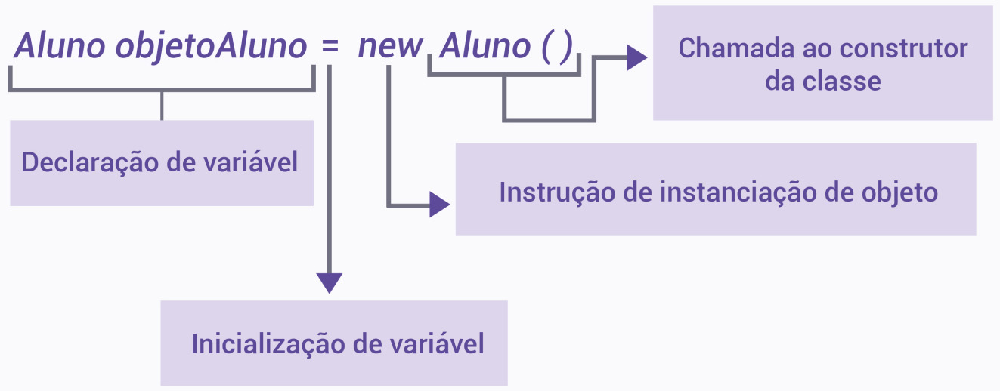
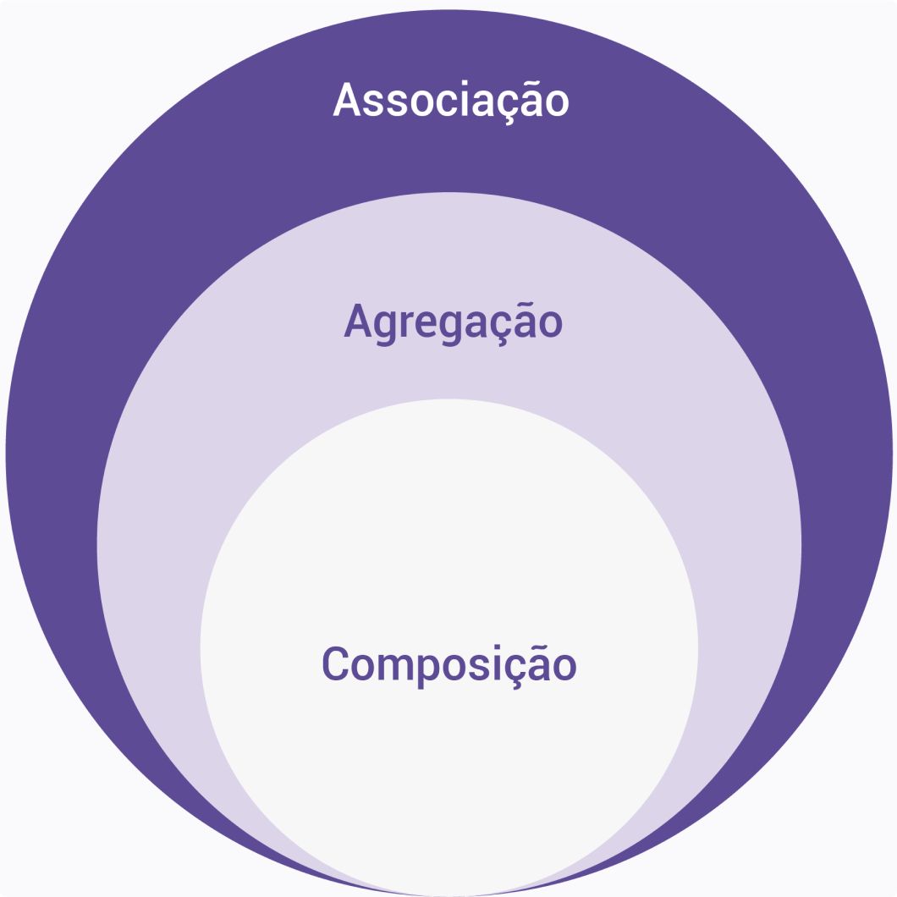

## Classes e objetos em Java

Vamos começar estudando os conceitos de classes na linguagem de programação Java. Neste momento, o nosso objetivo é entender o potencial do Java e já iniciar a implementar alguns exemplos. No entanto, vamos aprofundar os conceitos mais adiante. Por isso, se você ainda não conhece essa linguagem de programação, não se preocupe, pois vamos analisá-la com muitos detalhes mais adiante. Aproveite para conhecer uma das linguagens de programação mais importantes da atualidade e que, durante muito tempo, foi considerada a referência para programação orientada a objetos.

Assista e obtenha uma visão abrangente da linguagem de programação Java e seu incrível potencial. Explore a criação de classes e sua implementação em Java, além de aprender sobre símbolos de declaração e a utilização de modificadores.

### Classe e sua realização em Java

Em POO, uma classe é uma maneira de se criar objetos que possuem mesmo comportamento e mesma estrutura. Ou seja, uma classe é uma estrutura definida por:

- Dados
- Métodos que operam sobre esses dados
- Mecanismo de instanciação dos objetos


O conjunto formado por dados e métodos (assinatura e semântica) estabelece o contrato existente entre o desenvolvedor da classe e o seu usuário.

O código a seguir mostra um exemplo de uma classe em Java:

```java
public class Aluno {
    private String nome; 
    public void inserirNome(String nn) {
        nome = nn;
    }
    public String recuperarNome() {
        return nome;
    }
    public static void main(String args[]){
        Aluno a = new Aluno(); 
        a.inserirNome ("Pessoa");
        System.out.println("saida: "+a.recuperarNome());
    }
} 
```

Em Java, cada classe pública deve estar em um arquivo com o mesmo nome da classe e extensão “java”. Logo, a classe do código superior deve ser salva em um arquivo de nome “Aluno.java”.

Dica:
O site jdoodle possui um compilador java online, onde você pode copiar e executar os códigos.


A classe “Aluno”, possui um atributo do tipo “String” (nome) e dois métodos (inserirNome e recuperarNome). Além disso, podemos notar as palavras reservadas "private" e "public". Nós usamos essas instruções para modificar a acessibilidade de métodos, atributos e classes. O trecho mostrado é um exemplo bem simples de declaração de uma classe em Java. Pela especificação da linguagem (GOSLING et. al., 2020), há duas formas de declaração de classes. Veja!

- 1: Normal
- 2: Enum

A partir disso, vamos nos deter apenas à forma normal.

```java
[Modificador] class Identificador [TipoParâmetros] [Superclasse] [Superinterface] { [Corpo da Classe] }
```

Na sintaxe mostrada, os colchetes indicam elementos opcionais. Os símbolos que não estão entre colchetes são obrigatórios, sendo que “Identificador” é um literal. Logo, a forma mais simples possível de se declarar uma classe em Java é:

```java
class ClasseSimples { }
```

Observamos nessa declaração a presença dos símbolos reservados (e obrigatórios) e a existência do Identificador (ClasseSimples).


### Mais símbolos de declaração

Agora, vamos conhecer outros símbolos da declaração. Os modificadores podem ser qualquer elemento do seguinte conjunto:

```java
{Annotation, public, protected, private, abstract, static, final, strictfp}.
```

Considerando que:

- Annotation:
  - É uma definição e não propriadamente um elemento. Sua semântica implementa o conceito de anotações em Java e pode ser substituída por uma anotação padrão ou criada pelo programador.
- Public, protected e private
  - São os símbolos que veremos quando falarmos de encapsulamento. Eles são os modificadores de acesso.
- Abstract e final
  - São modificadores que relacionam-se com a hierarquia de classes.
- Static
  - É o modificador que afeta o ciclo de vida da instância da classe e só pode ser usado em classes membro.
- Strictfp
  - É um modificador que torna a implementação de cálculos de pontos flutuantes (números dos conjuntos dos reais) independentes da plataforma. Sem o uso desse modificador, as operações se tornam dependentes da plataforma sobre a qual a máquina virtual é executada.

### Composição de modificadores
Podemos combinar alguns desses modificadores com outros. Por exemplo, podemos definir uma classe da seguinte forma:

```java
public abstract class Teste { }
```

Outro elemento opcional são os "TipoParâmetros". Vale ressaltar que esses elementos estão relacionados à implementação de programação genérica em Java, e estão além do escopo abordado neste contexto.

O elemento opcional seguinte é a "Superclasse". Tanto a Superclasse quanto o "Superinterface" permitem ao Java implementar a herança entre classes e interfaces. O elemento "Superclasse" será sempre do tipo "extends IdentificadorClasse", no qual "extends" (palavra reservada) indica que a classe é uma subclasse de "IdentificadorClasse" e que outras classes vão herdar as características dela.

Outro ponto importante nessa visão geral do Java, é a sintaxe do elemento "Superinterface". Ele utiliza a palavra-chave "implements IdentificadorInterface". Isso significa que a classe implementa a interface "IdentificadorInterface".

Veja a seguir um exemplo mais complexo que utiliza mais recursos de declaração de classe em Java:

```java
@Deprecated @SuppressWarnings ("deprecation") public abstract strictfp class Aluno extends Pai implements Idealizacao, Sonho {
    private String nome; 
    public void inserirNome(String nn){
        nome = nn;
    }
    public String recuperarNome(){
       return nome;
    }
    ...//outros métodos ocultados por simplicidade    
}
```

Esse exemplo código é apenas conceitual. A ideia é nos acostumarmos com o Java e obtermos o melhor do potencial que ele pode nos oferecer.


## Objetos: os produtos das classes


Aqui, vamos começar a conhecer as classes em Java com mais profundidade. Em especial, vamos dar destaque para dois aspectos muito importantes: o método construtor e a instanciação de classes. Dessa forma, vamos obter mais familiaridade com o Java e entender alguns dos motivos que o tornaram tão popular.

Neste vídeo, vamos explorar a instância de classes no Java, aprofundar nosso entendimento sobre o método construtor especial e sua relevância para o ciclo de vida dos objetos. Também discutiremos os diferentes estados de um objeto em Java.

### Instanciação de classes

As classes são modelos. Para realmente realizarmos atividades em um programa, precisamos instanciá-las. Chamamos essas instâncias de objetos. Para compreendermos melhor o que é um objeto, vamos analisar seu ciclo de vida. A criação de um objeto ocorre em duas etapas:

1 - Declaramos um objeto como sendo do tipo de uma classe. 
2 - Na sequência, instanciamos o objeto e passamos a utilizá-lo. 

Aqui é importante destacarmos que o objeto tem todas as características da classe, ou seja, atributos e métodos. Uma forma de declararmos um objeto é dada por:

```java
Aluno objetoAluno = new Aluno();
```


Podemos, ainda, reescrever esse código da seguinte maneira:

```java
                  Aluno objetoAluno; 
                  objetoAluno = new Aluno();

```


O processo de criação do objeto começa com a alocação do espaço em memória. E prossegue com a execução do código de construção do objeto por meio de um método especial chamado construtor.

O método construtor é sempre executado quando fazemos a instanciação de um objeto e, obrigatoriamente, deve ter exatamente o mesmo nome da classe. Além disso, ele pode ter um modificador, mas não pode ter tipo de retorno. A instrução “new” é sempre seguida da chamada ao construtor da classe. Finalmente, a atribuição (“=”) inicializa a variável com o retorno (referência para o objeto) de “new”. Veja a seguir como ocorre esse processo de criação de objetos:



### Exemplo de um código que utiliza construtor

O objetivo desse código é criarmos uma classe “Aluno” com atributos e alguns métodos. No entanto, o ponto mais importante que devemos observar é o uso do método construtor que possui o mesmo nome da classe, conforme podemos ver no código a seguir:

```java
      import java.util.Random;
      public class Aluno{    
      //Atributos
      private String nome;
      private int idade;
      private double codigo_identificador;
      private Random aleatorio;
      //Construtor
      public Aluno(String nome, int idade){
           aleatorio = new Random();
           this.nome = nome;
           this.idade = idade;
           this.codigo_identificador = aleatorio.nextDouble();
      }
      //Métodos
      public void definirNome(String nome){
           this.nome = nome;
      }  
      public void definirIdade( int idade){
           this.idade = idade;
      }
    }
```

Devemos notar que o método construtor e classe possuem o mesmo nome. Além disso, passamos dois parâmetros para o construtor para estabelecer o comportamento inicial do objeto que vai instanciá-la. Outro ponto que precisamos observar é o escopo das variáveis dentro de uma classe. Por exemplo, vamos supor que tirássemos o trecho do seguinte código.

```java
private Random aleatorio;
```

A partir disso, faríamos a modificação dos atributos da classe e alteraríamos a instanciação da variável "aleatorio" dentro do construtor para:

```java
Random aleatorio = new Random();
```

A variável “aleatorio” seria válida apenas no escopo local do método construtor, ou seja, não seria um atributo da classe "Aluno" e, portanto, só poderia ser usada dentro do construtor.


### Estados de um objeto

O estado de um objeto é definido pelos seus atributos, enquanto seu comportamento é determinado pelos seus métodos. Por exemplo, vamos considerar a seguinte instanciação a partir da classe do código anterior:

```java
Aluno novoAluno = new Aluno("teste de instanciação", 50);
```


Após a execução do código, teremos um objeto criado e armazenado em memória identificado por “novoAluno”. O estado desse objeto é definido pelas variáveis “nome, idade, codigo e aleatorio”, e seu comportamento é dado pelos métodos “public Aluno (String nome, int idade), public void definirNome (String nome) e public void definirIdade (int idade)”.

Por fim, chegamos à última etapa do ciclo de vida de um objeto: a sua destruição. Na linguagem Java, não é possível ao programador destruir manualmente um objeto. Em vez disso, o Java implementa o conceito de coletor de lixo no qual a JVM varre o programa verificando objetos que não estejam mais sendo referenciados. Ao encontrar tais objetos, a JVM os destrói e libera a memória. O programador não possui qualquer controle sobre isso.


**Atenção!**
O programador tem a possibilidade de solicitar à JVM a realização da coleta de lixo, através da invocação do método "gc()" da biblioteca System. Mas isso é apenas uma solicitação, ou seja, não é uma ordem de execução. Na prática, isso significa que a JVM tentará executar a coleta de lixo tão logo quanto possível, mas não necessariamente quando o método foi invocado. 


## Classes e o encapsulamento de código


Do ponto de vista da POO, o encapsulamento visa ocultar do mundo exterior os atributos e o funcionamento da classe.

Para realizarmos a interação do objeto com os demais módulos de um sistema, precisamos estabelecer métodos públicos da classe. No entanto, ainda temos outras formas de visibilidade dos métodos que restringem o acesso a eles. Tudo isso é o que chamamos de contrato, estabelecido entre a classe e o código que a utiliza. A ideia do encapsulamento é disponibilizar para os demais módulos do sistema apenas o que eles precisam para realizar suas tarefas. Portanto, o conceito de encapsulamento está fortemente relacionado ao de visibilidade.

A visibilidade de um método ou atributo define quem pode ou não os acessar, ou seja, ela afeta a forma como o encapsulamento funciona. Existem três tipos de visibilidade, representados pelos seguintes modificadores:

1 - private
2 - protected
3 - public


Quando tratarmos sobre as propriedades de herança e polimorfismo, vamos nos aprofundar mais sobre o uso desses modificadores. Por enquanto, deve ficar claro para nós que “private” indica que o método ou atributo só pode ser acessado internamente à classe, enquanto “public” define que ambos são visíveis para todo o exterior.

Neste vídeo, você vai conhecer a propriedade de encapsulamento da orientação a objetos. Em especial, vamos estudar um exemplo prático no Java, para que você possa explorar melhor essa propriedade.

### Roteiro de prática

#### Passo 1

No caso do Java, o encapsulamento é um mecanismo que permite o agrupamento de dados e métodos em uma única unidade chamada classe que atende a dois propósitos principais. Vamos conferí-los!

- Ocultação de dados
  - O estado interno de um objeto é oculto do acesso externo. Os membros de dados internos de uma classe são declarados como privados, impedindo o acesso direto de outras classes. Para obtermos acesso a esses membros, devemos usar métodos públicos (getters e setters), que controlam as operações de leitura e gravação nos dados. Isso garante que os dados sejam acessados e modificados de forma controlada, mantendo a integridade do estado do objeto.
- Abstração
  - O encapsulamento permite o conceito de abstração ao fornecer uma interface simplificada e bem definida para interagir com um objeto. A classe expõe métodos públicos que definem seu comportamento, enquanto os detalhes da implementação interna ficam ocultos. Essa abstração facilita o uso da classe, pois os usuários não precisam conhecer as complexidades internas. O encapsulamento ajuda a gerenciar a complexidade e permite a programação modular dividindo o código em unidades menores (classes).

#### Passo 2

Agora, implemente o exemplo de código em Java que usa o encapsulamento:

```java
import java.util.Random;
    //Classe
    public class Pessoa {    
    //Atributos
    private String nome;
    private double codigo_identificador;
    private Random aleatorio;   
    //Métodos
    public Pessoa (String nome){
         aleatorio = new Random();
         this.setNome(nome);
         this.codigo_identificador = aleatorio.nextDouble();
    }
    private void setNome (String nome) {
         this.nome = nome;
    }  
    public String getNome () {
         return this.nome;
    }
    public double getCodigoIdentificador (){
         return this.codigo_identificador;
    }   
    public static void main(String args[]){
        Pessoa p1 = new Pessoa("Teste A");
        System.out.println("Pessoa 1: "+p1.getNome());
    }
}
```

#### Passo 3

Execute o programa e observe o resultado:

**Pessoa 1: Teste A**

Os pontos mais importantes que devemos observar nesse código são:

1: O modificador “private” usado no método “setNome”, o qual indica que ele só pode ser usado por métodos dentro da própria classe. 
2: O modificador “public” usado nos métodos “getNome” e “getCodigoIdentificador”, os quais indicam que podem ser chamados por objetos que instanciam a classe. 

É interessante executar esse exemplo para que você comece a ganhar mais segurança sobre a sintaxe da linguagem Java e, além disso, perceba as vantagens de proteger os dados da classe e garantir um comportamento previsível.


## Tipos de relações entre objetos

Na POO, temos os seguintes tipos de relações entre objetos. Vamos conferí-los!

- Associação
  - É semanticamente a relação mais fraca e se refere a objetos que consomem – usam – serviços ou funcionalidades de outros. Ela pode ocorrer mesmo quando nenhuma classe possui a outra e cada objeto instanciado tem sua existência independente do outro. Essa relação pode ocorrer com cardinalidade “um para um”, “um para vários”, “vários para um” e “vários para vários”.
- Agregação
  - Ocorre entre dois ou mais objetos, com cada um tendo seu próprio ciclo de vida, mas com um objeto (pai) contendo os demais (filhos). Precisamos compreender que, nesse caso, os objetos filhos podem sobreviver à destruição do objeto pai. Um exemplo de agregação se dá entre as classes “Escola” e “Aluno”, pois se uma escola deixar de existir, não significa que os alunos simplesmente deixarão de existir.
- Composição
  - Difere sutilmente da agregação, pois ocorre quando há uma relação de dependência entre o(s) filho(s) e o objeto pai. Caso o pai deixe de existir, necessariamente o filho será destruído. Por exemplo, no caso da relação entre uma classe “Escola” e as classes “Departamentos”, certamente, que a extinção da escola implica a extinção dos departamentos.


A partir disso, veremos como os conceitos de associação, agregação e composição formam conjuntos que se relacionam. Confira!




Conforme podemos concluir, a composição é um caso especial de agregação e o conceito mais restritivo de todos, enquanto a associação é o mais abrangente.

Neste vídeo, você terá a oportunidade de identificar as diferentes relações que podem ser implementadas no Java, além de assistir a um exemplo prático que demonstrará como aplicar essas relações.


### Roteiro de prática

### Passo 1

Veja a seguir um exemplo de código em Java que nos auxilia a compreender de forma mais clara as relações de agregação e composição entre objetos.

```java
class Escola {
    //Atributos
    private String nome, CNPJ;   
    private Endereco endereco;
    private Departamento departamentos [];
    private Aluno discentes [];
    private int nr_discentes , nr_departamentos;
 
    //Métodos
    public Escola ( String nome , String CNPJ) {
        this.nome = nome;
        this.CNPJ = CNPJ;
        this.departamentos = new Departamento[10];
        this.discentes = new Aluno[1000];
        this.nr_departamentos = 0;
        this.nr_discentes = 0;
    }
    public void criarDepartamento(String nomeDepartamento){
        if(nr_departamentos <= 10)
        {
            departamentos[nr_departamentos] = new Departamento ( nomeDepartamento);                
            nr_departamentos++;
        } else {
            System.out.println ( "Nao e possivel criar outro Departamento." );
       }
    public void matricularAluno ( Aluno novoAluno ) {
       discentes [ nr_discentes ] = novoAluno;
    }
}
```

### Passo 2

Agora, vamos destacar alguns pontos importantes e que devem ser observados:

- Devemos notar uma associação entre a classe Escola” e as classes “Endereco”, “Departamento” e “Aluno”.
- Devemos notar uma relação entre a classe “Escola” e “Aluno”. Nesse caso, trata-se de uma agregação, pois os alunos ainda vão existir no caso de a escola ser extinta.
- Uma vez que o objeto do tipo “Escola” for destruído, necessariamente todos os objetos do tipo “Departamento” também serão destruídos. Isso mostra uma relação forte entre ambas as classes com o ciclo de vida dos objetos de “Departamento” subordinados ao ciclo de vida dos objetos da classe “Escola”, ilustrando uma relação do tipo composição.


## Uso de referência de objetos em Java


Em Java, não é possível criar variáveis do tipo ponteiro. A linguagem Java oculta esse mecanismo, de modo que toda variável de classe é uma referência para o objeto instanciado. Isso tem implicações importantes na forma de lidar com objetos. Analisando um exemplo, vamos entender como isso funciona na prática.

Neste vídeo, você aprenderá a utilizar referências de objetos em Java e entenderá as implicações ao utilizar esse recurso. Faremos uma análise detalhada de um exemplo e apresentaremos um exemplo completo de como referenciar objetos.


### Roteiro de prática

A passagem de um objeto como parâmetro em um método, ou o retorno dele, é sempre uma passagem por referência. Isso não ocorre com tipos primitivos, que são sempre passados por valor.

#### Passo 1

Implemente os seguintes códigos:

```java
class Aluno {
    
    //Atributos
    private String nome;
    private int idade;
    //Métodos
    public Aluno ( String nome , int idade ) {
         this.nome = nome;
         this.idade = idade;
    }
    public void definirNome ( String nome ) {
         this.nome = nome;
    }  
    public void definirIdade ( int idade ) {
         this.idade = idade;
    }
    public String recuperarNome () {
         return this.nome;
    }     
}
```

### Passo 2

Implemente a classe “Referencia”, cujo código é apresentado a seguir:

```java
public class Referencia  {
       private Aluno a1 , a2;
       public Referencia  ( ) {
        a1 = new Aluno ( "Carlos" , 20);
        a2 = new Aluno ( "Ana" , 23 );
        System.out.println("O nome do aluno a1 é " + a1.recuperarNome());
        System.out.println("O nome do aluno a2 é " + a2.recuperarNome());
        a2 = a1;
        a2.definirNome("Flávia");
        System.out.println("O nome do aluno a1 é " + a1.recuperarNome());
        manipulaAluno ( a1 );
        System.out.println("O nome do aluno a1 é " + a1.recuperarNome());
       }
       public void manipulaAluno ( Aluno aluno ) {
        aluno.definirNome("Márcia");
       }
       public static void main(String args[]) {
           Referencia r = new Referencia ();
           System.out.println("Fim da Execução ");
    }

}
```

### Passo 3

Execute o programa e veja se o resultado da execução desse código é:


```java
nome do aluno a1 é Carlos
nome do aluno a2 é Ana
nome do aluno a1 é Flávia
nome do aluno a1 é Márcia
```


Vamos entender o que acontece seguindo passo a passo a execução do código visto anteriormente.

A classe principal desse código é a classe “Referencia”. Logo, já sabemos que o nome do arquivo deve ser “Referencia.java”. Dentro dela, há o método estático “main”, no qual criamos um objeto do tipo “Referencia”. Nesse momento, a JVM passa a instanciar dois objetos do tipo Aluno. Sendo que o objeto “a1” fica com o estado dos atributos “nome” e “idade”, respectivamente, dados por "Carlos" e "20".

Já o objeto “a2” fica com “nome” recebendo “Ana” e “idade” recebendo “23”. Ou seja, temos dois objetos distintos (“a1” e “a2”), cujos estados também são distintos.

Mais à frente, executamos a linha:

```java
a2 = a1;

```


Que significa que “a1” e “a2” são referências para os objetos criados, ou seja, não é um caso de atribuição. Por isso que, ao modificarmos o estado do objeto “a2”, também afetamos o estado do objeto “a1”.

Outro ponto interessante ocorre quando chamamos o método “manipulaAluno”, pois, como dissemos, a passagem de objetos é sempre feita por referência. Logo, a variável “aluno” na assinatura do método “manipulaAluno” vai receber a referência guardada por “a1”. Desse momento em diante, todas as operações feitas usando “aluno” ocorrem no mesmo objeto referenciado por “a1” que tem impacto também no objeto “a2”.

Apesar do Java oferecer esse recurso de referência de objetos, devemos evitá-lo, pois o código pode ficar confuso e difícil de dar manutenção posteriormente. Bem, agora, chegou a hora de praticar!
