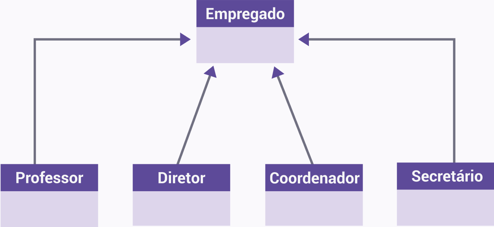
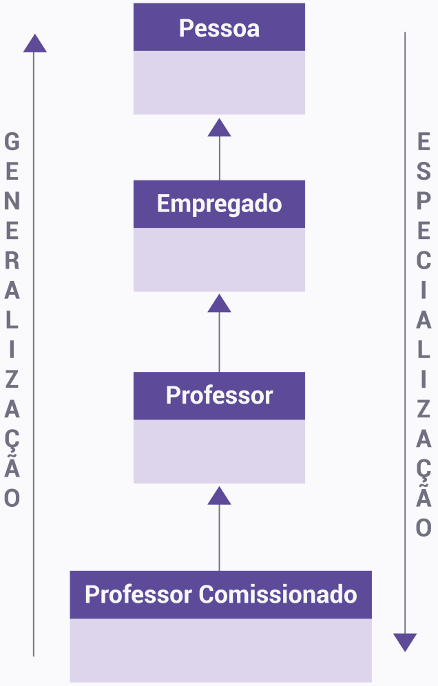
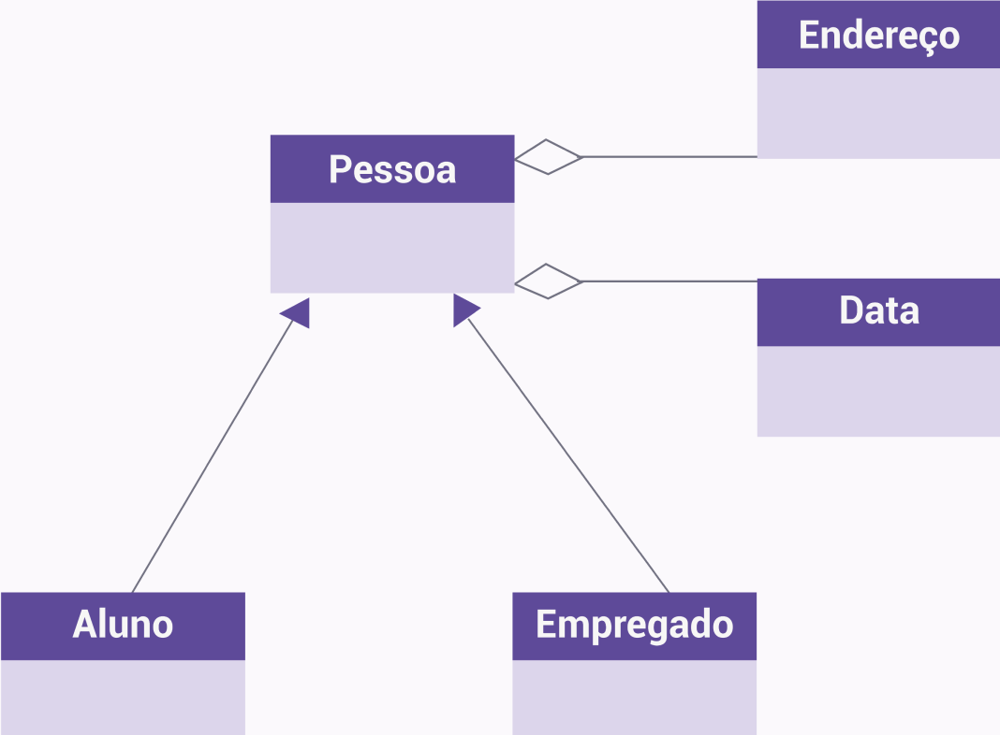
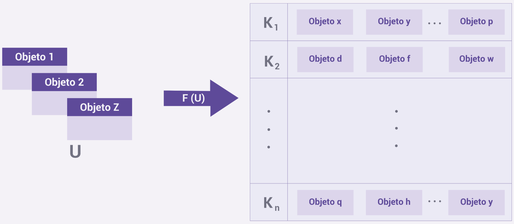

## Introdução à Programação oo em Java

O termo herança em OO define um tipo de relação entre objetos e classes, baseado em uma hierarquia. Dentro dessa relação hierárquica, classes podem herdar características de outras classes situadas acima ou transmitir suas características às classes subsequentes.

Neste vídeo, você terá a oportunidade de explorar os conceitos relacionados à herança e aprender como implementá-los de forma eficiente em Java. Além disso, abordaremos os elementos fundamentais da herança, a herança de interfaces e como lidar com múltiplas superclasses.


### Elementos básicos da herança

Uma classe situada hierarquicamente acima é chamada de superclasse, enquanto aquelas situadas abaixo chamam-se subclasses. Essas classes podem ser, também, referidas como classe base ou pai (superclasse) e classe derivada ou filha (subclasse).

A herança nos permite reunir os métodos e atributos comuns em uma superclasse, que os leva às classes filhas. Isso evita repetir o mesmo código várias vezes. Outro benefício está na manutenibilidade: caso uma alteração seja necessária, ela só precisará ser feita na classe pai, e será automaticamente propagada para as subclasses.

Observe a seguir um diagrama UML que modela uma hierarquia de herança.



### Como tratar mais de uma superclasse

Essa situação é denominada herança múltipla e, apesar de a POO aceitar a herança múltipla, a linguagem Java não oferece suporte para esse tipo de caso. No entanto, apesar de não permitir herança múltipla de classes, a linguagem permite que uma classe herde de múltiplas interfaces.


Atenção!

É importante ressaltar que uma interface pode herdar de múltiplas interfaces pai. Ao contrário das classes, as interfaces não permitem a implementação de métodos, sendo responsabilidade da classe que as implementa realizar essa implementação.

Agora, vamos analisar a seguinte imagem:




Ao analisar a genealogia das classes, observamos que à medida que descemos na hierarquia, nos deparamos com classes cada vez mais específicas. Por outro lado, ao subir na hierarquia, nos deparamos com classes cada vez mais gerais. Essas características refletem os conceitos fundamentais de generalização e especialização da OO.

Agora, vamos visualizar um exemplo de código que demonstra a implementação da herança para a classe "ProfessorComissionado" com baseado na imagem anterior:

```java
public class ProfessorComissionado extends Professor {  
//… 
}
```

Em outras palavras, ao utilizar a herança, é importante notar que ela é declarada apenas para a classe ancestral imediata. Com isto, podemos afirmar que:

1 - A classe “Professor” deve declarar “Empregado” como sua superclasse. 
2 - O “Empregado” deve declarar “Pessoa” como sua superclasse. 

### Herança de interfaces

A sintaxe é análoga para o caso das interfaces, exceto que pode haver mais de um identificador de superinterface. O código consecutivo mostra um exemplo baseado no diagrama anterior, considerando que “ProfessorComissionado”, “Professor” e “Diretor” sejam interfaces.

```java
public interface ProfessorComissionado extends Professor, Diretor {
//…
}
```


Nesse exemplo, a herança múltipla pode ser vista pela lista de superinterfaces (“Professor” e “Diretor”) que se segue ao modificador “extends”.

Algo interessante de se observar é que em Java todas as classes descendem direta ou indiretamente da classe “Object”. Isso torna os métodos da classe “Object” disponíveis para qualquer classe criada. O método “equals ()”, da classe “Object”, por exemplo, pode ser usado para comparar dois objetos da mesma classe.

Se uma classe for declarada sem estender nenhuma outra, então o compilador assume implicitamente que ela estende a classe “Object”. Se ela estender uma superclasse, como no código, então ela é uma descendente indireta de “Object”.


Resumindo

Na herança com vários níveis de ancestralidade, a classe "Pessoa" é uma subclasse de "Object" e, portanto, herda todos os métodos de "Object". Esses métodos são herdados pelas subclasses subsequentes até a base da hierarquia de classes. Consequentemente, um objeto da classe "ProfessorComissionado" terá acesso a todos os métodos disponíveis em "Object". 


**Atividade 1**

A herança é uma propriedade típica da programação orientada a objetos e é disponível pelo Java. Obviamente, sempre precisamos usar essa propriedade com cuidado, pois, caso contrário, podemos tornar o código bem complicado de entender. Neste sentido, sobre herança em Java, é correto afirmar apenas que:

*R: O mecanismo de herança oferece para subclasse a mesma estrutura da superclasse. Portanto, o objeto da classe filha tem as mesmas propriedades da classe mãe.*


## Herança e visibilidade


Quando dizemos que a classe “Pessoa” é uma generalização da classe “Empregado”, isso significa que ela reúne atributos e comportamentos que podem ser generalizados para outras subclasses. Esses comportamentos podem ser especializados nas subclasses, isto é, as subclasses podem sobrescrever o comportamento modelado na superclasse. Nesse caso, a assinatura do método pode ser mantida, mudando-se apenas o código que o implementa. Aqui, vamos abordar esses pontos que já são um avanço do que podemos fazer com a propriedade herança.

Neste vídeo, você vai aprender sobre os modificadores em Java, aplicáveis a atributos, métodos e classes, auxiliando na compreensão da combinação das propriedades da programação orientada a objetos e na construção de projetos mais organizados e controlados.

### Mecanismos de visibilidade

Inicialmente, precisamos compreender como os modificadores de acesso operam. Já vimos que esses modificadores alteram a acessibilidade de classes, métodos e atributos. Existem quatro níveis de acesso em Java. Vamos conhecê-los!

- Default: É assumido quando nenhum modificador é usado. Define a visibilidade como deve ser restrita ao pacote do Java.
- Privado: É declarado pelo uso do modificador “private”. A visibilidade dos atributos e métodos fica restrita à classe.
- Protegido: É declarado pelo uso do modificador “protected”. A visibilidade é restrita ao pacote e a todas as subclasses.
- Público: É declarado pelo uso do modificador “public”. Não há restrição de visibilidade.


Os modificadores de acessibilidade ou visibilidade operam controlando o escopo no qual se deseja que os elementos (classes, atributos ou métodos) fiquem visíveis aos demais elementos que compõem um código. Ainda temos o escopo definido por um pacote no Java, cuja ideia é que ele defina um espaço de nomes e seja usado para agrupar classes relacionadas.

O conceito de pacote contribui para a melhoria da organização do código de duas maneiras. Confira!

1 - Permite organizar as classes pelas suas afinidades conceituais. 
2 - Previne conflito de nomes. 

Devemos observar que evitar conflitos de nomes é um trabalho desafiador em um software que envolva diversos desenvolvedores e centenas de entidades e funções.

### Pacotes em Java

Em Java, um pacote é definido pela instrução “package” seguida do nome do pacote inserida no arquivo de código-fonte. Todos os arquivos que contiverem essa instrução terão suas classes agrupadas no pacote. Isso significa que todas essas classes, isto é, classes do mesmo pacote, terão acesso aos elementos que tiverem o modificador de acessibilidade "default".

O modificador “private” é o mais restrito, pois limita a visibilidade ao escopo da classe. Isso quer dizer que um atributo ou método definido como privado não pode ser acessado por qualquer outra classe senão aquela na qual foi declarado. Isso é válido também para classes definidas no mesmo arquivo e para as subclasses.

O acesso aos métodos e atributos da superclasse pode ser concedido pelo uso do modificador “protected”. Esse modificador restringe o acesso a todas as classes do mesmo pacote. Classes de outros pacotes têm acesso apenas mediante herança.

Já, o modificador de acesso “public” é o menos restritivo. Ele fornece acesso com escopo global. Qualquer classe do ambiente de desenvolvimento pode acessar as entidades declaradas como públicas.

A seguir, observe a tabela que sumariza a relação entre os níveis de acesso e o escopo.


|                          | default | public | private | protected |
|--------------------------|---------|--------|---------|-----------|
| Subclasse do mesmo pacote      | sim     | sim    | não      | sim       |
| Subclasse de pacote diferente | não     | sim    | não      | sim       |
| Classe (não derivada) do mesmo pacote | sim     | sim    | não      | sim       |
| Classe (não derivada) de pacote diferente | não     | sim    | não      | não       |

As restrições impostas pelos modificadores de acessibilidade são afetadas pela herança da seguinte maneira:

1 - Métodos (e atributos) declarados públicos na superclasse devem ser públicos nas subclasses. 
2 - Métodos (e atributos) declarados protegidos na superclasse devem ser protegidos ou públicos nas subclasses. Eles não podem ser privados. 

Portanto, devemos observar também que métodos e atributos privados não são accessíveis às subclasses, e sua acessibilidade não é afetada pela herança.


**Atividade 2**

O Java oferece o uso de palavras-chave para que possamos aplicar os modificadores. A escolha do uso desses modificadores, no entanto, é de total responsabilidade do desenvolvedor. Nesse sentido, assinale a alternativa correta sobre qual o impacto positivo de uma boa escolha do uso dos modificadores:

*R: Os modificadores de acessibilidade são importantes para estabelecer qual o comportamento que esperamos que um objeto tenha durante o processo de execução. Eles estão fortemente relacionados a diversas outras propriedades da programação orientada a objetos, como um mecanismo de evitarmos comportamentos anômalos e garantir a segurança dos atributos e métodos das classes.*


## Exemplo prático de herança

Nós já estudamos os aspectos conceituais mais importantes sobre herança, encapsulamento e uso de modificadores de acesso. Agora, vamos aplicar esses conceitos com exemplos implementados no Java para ganharmos mais familiaridade com a linguagem e suas propriedades.

Neste vídeo, vamos explorar a implementação prática de códigos em Java, enfatizando as propriedades de herança, encapsulamento e modificadores de acesso. A partir disso, também utilizaremos os modificadores de acesso.

### Roteiro de prática

O nosso objetivo aqui é implementar o modelo representado a seguir:



Basicamente, o que temos são relações entre classes que desempenham papéis bem distintos. Por exemplo, a classe “Pessoa” generaliza as classes “Empregado” e “Aluno”. Enquanto as classes “Endereço” e “Data” são exemplos de relações de agregação.

### Passo 1: Implementação da classe Pessoa

A classe "Pessoa" é a “superclasse” do sistema que modelamos. Na sequência, você encontrará o código em Java que representa essa classe:

```java
public class Pessoa {
    //Atributos
    private String nome;
    private int idade;
    private Calendar data_nascimento;
    private long CPF;
    private Endereco endereco;
    //Métodos
    public Pessoa(String nome, Calendar data_nascimento, long CPF, Endereco endereco){
        this.nome = nome;
        this.data_nascimento = data_nascimento;
        this.CPF = CPF;
        this.endereco = endereco;
        atualizarIdade();
    }
    protected void atualizarNome(String nome){
        this.nome = nome;
    }
    protected String recuperarNome(){
        return this.nome;
    }
    protected void atualizarIdade(){
        this.idade = calcularIdade();
    }
    protected int recuperarIdade() {
        return this.idade;
    }
    protected void atualizarCPF(long CPF){
        this.CPF = CPF;
    }
    protected long recuperarCPF(){
        return this.CPF;
    }
    protected void atualizarEndereco(Endereco endereco){
        this.endereco = endereco;
    }
    protected Endereco recuperarEndereco(){
        return this.endereco;
    }
    private int calcularIdade(){
        int lapso;
        Calendar hoje = Calendar.getInstance();
        lapso = hoje.get(YEAR) - data_nascimento.get(YEAR);
        if ((data_nascimento.get(MONTH) > hoje.get(MONTH)) || ( data_nascimento.get(MONTH) ==                 
        hoje.get(MONTH) && data_nascimento.get(DATE) > hoje.get(DATE)))
            lapso--;
        return lapso;
    }
}
```

Também podemos observar que o código da classe “Pessoa” possui um construtor não vazio. Assim, os construtores das classes derivadas precisam passar para a superclasse os parâmetros exigidos na assinatura do construtor. Isso é feito pela instrução “super”.

### Passo 2: Implementação da classe Aluno

A classe “Aluno” herda as características da classe “Pessoa”. Confira o respectivo código em Java:

```java
public class Aluno extends Pessoa {
    //Atributos    
    private String matricula;
    //Métodos
    public Aluno(String nome, Calendar data_nascimento, long CPF, Endereco endereco){
        super (nome, data_nascimento, CPF, endereco);
    }
}
```

Devemos observar o uso da palavra-chave “super” no construtor da classe “Pessoa” que significa que a classe Pessoa faz uso do construtor da classe Aluno.


### Passo 3: Implementação da classe Empregado

A classe “Empregado” também herda as características da classe “Pessoa”. Veja o código em Java:

```java
public class Empregado extends Pessoa {
    //Atributos
    protected String matricula;
    private Calendar data_admissao , data_demissao;
    //Métodos
    public Empregado(String nome, Calendar data_nascimento, long CPF, Endereco endereco) {
        super(nome, data_nascimento, CPF, endereco);
        this.matricula = gerarMatricula ();
        data_admissao = Calendar.getInstance();
    }
    public void demitirEmpregado () {
        data_demissao = Calendar.getInstance();
    }
    protected void gerarMatricula () {
        this.matricula = "Matrícula não definida.";
    }
    protected String recuperarMatricula () {
        return this.matricula;
    }
}
```
Semelhante à classe “Aluno”, devemos observar que o construtor da classe “Empregado” utiliza o “super” e que, além disso, ela estabelece os valores dos atributos “matrícula” e “data_admissao”.


### Passo 4: Implementação da classe Principal

Agora, apresentamos o código da classe “Principal” que é responsável por gerenciar o nosso sistema:

```java
public class Principal {
       //Atributos
       private static Aluno aluno;
       private static Endereco endereco;
       //Método main
       public static void main (String args[]) {
           int idade;
           Calendar data = Calendar.getInstance();
           data.set(1980, 10, 23);
           endereco = new Endereco ();
           endereco.definirPais("Brasil");
           endereco.definirUF("RJ");
           endereco.definirCidade ("Rio de Janeiro");
           endereco.definirRua("Avenida Rio Branco");
           endereco.definirNumero("156A");
           endereco.definirCEP(20040901);
           endereco.definirComplemento("Bloco 03 - Ap 20.005");
           aluno = new Aluno ("Marco Antônio", data ,901564098 , endereco);
           aluno.atualizarIdade();
           idade = aluno.recuperarIdade();
       }
}
```

Como observações finais, é importante estarmos atentos aos seguintes itens:

- Uma vez que foram fornecidos métodos protegidos capazes de manipular tais atributos, estes podem ser perfeitamente alterados pela subclasse. Em outras palavras, uma subclasse possui todos os atributos e métodos da superclasse, mas não tem visibilidade daqueles que são privados.
- Isso significa que podemos entender que a subclasse herda aquilo que lhe é visível (ou acessível). Por isso, a subclasse "Aluno" é capaz de usar o método privado “calcularIdade ()”da superclasse. Porém, ela o faz por meio da invocação do método protegido “atualizarIdade()”, como vimos na classe “Aluno”.


## Polimorfismo

O polimorfismo é a propriedade de um mesmo método se comportar de formas distintas para assinaturas de métodos diferentes. Ele pode se expressar de diversas maneiras. A sobrecarga de função, assim como a herança, é uma forma de dar ao objeto uma capacidade polimórfica. No caso da herança, o polimorfismo surge justamente porque um objeto pode se comportar também como definido na superclasse. Por exemplo, vamos considerar um objeto do tipo “Aluno”.

**Comentário**
Como vimos, todo objeto do tipo “Aluno” é do tipo “Pessoa”. Logo, ele pode se comportar como “Aluno” ou como “Pessoa”.


Todo objeto que possui uma superclasse tem capacidade de ser polimórfico. A justificativa, como já dissemos, é que toda classe em Java descende direta ou indiretamente da classe “Object”.

O polimorfismo permite o desenvolvimento de códigos facilmente extensíveis, pois novas classes podem ser adicionadas para o restante do software. Basta que as novas classes sejam derivadas daquelas que implementam comportamentos gerais, como no caso da classe “Pessoa”.

Essas novas classes podem especializar os comportamentos da superclasse, isto é, alterar a sua implementação para refletir sua especificidade, e isso não impactará as demais partes do programa que se valem dos comportamentos da superclasse.

Neste vídeo, conheceremos os aspectos essenciais do polimorfismo na programação orientada a objetos. A partir disso, veremos um exemplo prático que demonstra como o polimorfismo pode ser aplicado, incluindo a sobrecarga de métodos.

### Roteiro de prática

#### Passo 1
Implemente a classe “Diretor” que é subclasse de “Empregado”, sendo código dado por:


```java
 public class Diretor extends Empregado {
   //Métodos   
   public Diretor(String nome, Calendar data_nascimento, long CPF, Endereco endereco) {
        super(nome, data_nascimento, CPF, endereco);    
   }    
   protected void gerarMatricula(){
        matricula = "E-" + UUID.randomUUID( ).toString( );  
   }
}
```

#### Passo 2
Implemente a modificação na classe “Principal”, cujo código é dado por:


```java
public class Principal {
    //Atributos
    private static Empregado empregado, diretor;
    //Método main
    public static void main(String args[]) {
        Calendar data = Calendar.getInstance();
        data.set(1980, 10, 23);
        empregado = new Empregado("Clara Silva", data , 211456937 , null);
        empregado.gerarMatricula();
        diretor = new Diretor ("Marco Antônio", data , 901564098 , null);
        diretor.gerarMatricula();
        System.out.println ("A matrícula do Diretor é: " + diretor.recuperarMatricula());
        System.out.println ("A matrícula do Empregado é: " + empregado.recuperarMatricula());
    }
}
```

#### Passo 3

Execute este código que produz como saída:

A matrícula do Diretor é: E-096d9a3d-98e9-4af1-af61-a03d97525429

A matrícula do Empregado é: Matrícula não definida.

Observe que estamos invocando o método “gerarMatricula ()” com uma referência do tipo da superclasse. Essa variável, porém, está se referindo a um objeto da subclasse e o método em questão possui uma versão especializada na classe “Diretor” (ela sobrescreve o método “gerarMatricula ()” da superclasse). Dessa maneira, durante a execução, o método da subclasse será chamado. Outra forma de polimorfismo pode ser obtida por meio da sobrecarga de métodos.

#### Passo 4

A sobrecarga é uma característica que permite que métodos com o mesmo identificador, mas diferentes parâmetros, sejam implementados na mesma classe. Ao usar parâmetros distintos em número ou quantidade, o programador permite que o compilador identifique qual método chamar.

Implemente o código modificado da classe “Diretor” que utiliza sobrecarga de métodos:

```java
public class Diretor extends Empregado {
   //Métodos
    public Diretor(String nome, Calendar data_nascimento, long CPF, Endereco endereco){
            super(nome, data_nascimento, CPF, endereco);    
   }    
   protected void gerarMatricula(){
            matricula = "E-" + UUID.randomUUID().toString();  
   }
    protected void alterarMatricula(){
            gerarMatricula();
    }
    protected void alterarMatricula(String matricula){
            this.matricula = matricula;
    }
}
```


Nesse caso, a classe está preparada para tratar a chamada do método “alterarMatricula” de duas formas. Veja!

Uma chamada do tipo “alterarMatricula ()” invocará o método a seguir:

```java
    protected void alterarMatricula(){
            gerarMatricula ();
    }
```

Por outro lado, caso seja feita uma chamada como “alterarMatricula (“M-202100-1000)”, o método chamado será:

```java
protected void alterarMatricula(String matricula){
this.matricula = matricula;
}
```

A diferença entre qual dos dois métodos será chamado está na passagem ou não do parâmetro.


## Classes abstratas


Uma classe abstrata é uma classe que não pode ser instanciada diretamente, mas serve como base para outras subclasses. Isso significa que ela pode ter atributos e métodos que podem ser herdados e estendidos por outras classes.

Além da questão de não poderem ser instanciadas, as classes abstratas podem conter métodos abstratos que são declarações de método sem uma implementação. Nesse caso, utilizamos as subclasses derivadas de uma classe abstrata para implementar esses métodos abstratos. Portanto, as classes abstratas são úteis quando precisamos definir uma interface comum para um grupo de classes relacionadas, mas deixamos os detalhes de implementação específicos para as subclasses.

Aqui, podemos perceber que a implementação dos métodos abstratos aplica o conceito de polimorfismo. Quando um método é implementado na classe abstrata, ele é chamado de método concreto. De forma semelhante, quando uma subclasse herda as características de uma classe abstrata e implementa os métodos dela, é chamada de classe concreta.

Neste vídeo, aprenderemos sobre classes abstratas e sua implementação em Java. A partir disso, veremos como esses recursos são valiosos para a definição de padrões de projetos em grande escala.


### Roteiro de prática

#### Passo 1
Implemente a classe abstrata “Animal” que possui um método abstrato chamado de “emitirSom” e um método concreto chamado de “dormir”. Na sequência, utilizamos duas subclasses herdeiras – as classes “Cachorro” e “Gato”- que vão implementar o método “emitirSom”. Acompanhe o código completo a seguir:


```java
// Classe Abstrata
abstract class Animal {
    // metodo abstrato
    public abstract void emitirSom();

    // metodo concreto
    public void dormir() {
        System.out.println("Zzzz...");
    }
}

// subclasse concreta
class Cachorro extends Animal {
    public void emitirSom() {
        System.out.println("Latir!");
    }
}

// subclasse concreta
class Gato extends Animal {
    public void emitirSom() {
        System.out.println("Miar!");
    }
}

public class Main {
    public static void main(String[] args) {
        Animal cachorro = new Cachorro();
        Animal gato = new Gato();

        cachorro.emitirSom();
        cachorro.dormir();    

        gato.emitirSom();  
        gato.dormir();      
    }
}
```

#### Passo 2

Execute o código que produz a seguinte saída:

Latir!

Zzzz...

Miar!

Zzzz...

Neste exemplo, é fundamental ressaltar que estamos aplicando vários conceitos que foram estudados até o momento, onde estão inclusos:

- Encapsulamento
- Herança
- Polimorfismo
- Classe abstrata


## Agrupamento de objetos em Java


O propósito do agrupamento é permitir que, a partir de um universo de objetos, grupos de objetos afins sejam estabelecidos com base em determinado critério. Esse é um dos motivos para o agrupamento nos interessar: a interação com conjuntos de dados.

Neste vídeo, aprenderemos os fundamentos do agrupamento de objetos em Java, abordando conceitos e práticas. Isso será útil para manipular grandes conjuntos de dados no dia a dia do desenvolvedor Java.


### Fundamentos do agrupamento de objetos

No agrupamento, o estado final desejado é ter os objetos agrupados, e cada agrupamento deve estar mapeado para a chave usada como critério. Em outras palavras, buscamos construir uma função tal que, a partir de um universo de objetos de entrada, tenha como saída “n” pares ordenados formados pela chave de particionamento e a lista de objetos agrupados:

F(U) = { [k1 , <lista agrupada>], [k2 , <lista agrupada>] , ..., [kn , <lista agrupada>] }

A partir disso, vemos uma representação do que pretendemos fazer:



Felizmente, a Java API oferece estruturas que facilitam o nosso trabalho. Para manter e manipular os objetos, usaremos o container “List”, que cria uma lista de objetos. Essa estrutura já possui métodos de inserção e remoção e pode ser expandida ou reduzida conforme a necessidade.


### Implementação de agrupamento de objetos

Para mantermos os pares de particionamento, usaremos o container “Map”, que faz o mapeamento entre uma chave e um valor. No nosso caso, a chave é o critério de particionamento e o valor é a lista de objetos particionados. A estrutura “Map”, além de possuir métodos que nos auxiliarão, não permite a existência de chaves duplicadas. Veja, então, um exemplo da classe “Aluno” modificada:


```java
public class Aluno {
    //Atributos    
    private String matricula,nome,naturalidade;
    //Métodos
    public Aluno(String nome,String naturalidade){
            this.nome=nome;
            this.naturalidade=naturalidade;
    }
        @Override
        public String toString(){
            return String.format("%s(%s)",nome,naturalidade);
        }
    }
}  
```

Para executar o agrupamento, vamos implementar a classe “Escola”, conforme este código:

```java
class Escola{
    //Atributos
    private String nome,CNPJ;   
    private Endereco endereco;
    private List departamentos;
    private List discentes;
    //Métodos
    public Escola(String nome,String CNPJ){
        this.nome=nome;
        this.CNPJ=CNPJ;
        this.departamentos=new ArrayList<Departamento>();
        this.discentes=new ArrayList<Aluno>();
    }
    public void criarDepartamento(String nomeDepartamento){
        departamentos.add(new Departamento(nomeDepartamento));
    }
    public void fecharDepartamento(Departamento departamento){
        departamentos.remove(departamento);
    }
    public void matricularAluno(Aluno novoAluno){
        discentes.add(novoAluno);
    }
    public void trancarMatriculaAluno(Aluno aluno){
        discentes.remove(aluno);
    }
    public void agruparAlunos(){
        Map<String,List<Aluno>> agrupamento=new HashMap<>();
        for (Aluno a: discentes){
            if(!agrupamento.containsKey(a.recuperarNaturalidade())) {
                 agrupamento.put(a.recuperarNaturalidade(),new ArrayList<>());
            }
        agrupamento.get(a.recuperarNaturalidade()).add(a);
        }
    System.out.println ("Resultado do agrupamento por naturalidade: "+agrupamento);
    }
}
```
Por fim, implementamos a classe “Principal” que é responsável pelo gerenciamento do nosso sistema:

```java
public class Principal {
    // Atributos
    private static Aluno aluno1,aluno2,aluno3,aluno4,aluno5,aluno6,aluno7,aluno8,aluno9;
    private static Escola escola;
    // Método main
    public static void main(String args[]) {
        escola = new Escola("Escola Pedro Álvares Cabral", "42.336.174/0006-13");
        criarAlunos();
        matricularAlunos();
        escola.agruparAlunos();
    }
    //Métodos
    private static void criarAlunos( ){
        aluno1 = new Aluno("Marco Antônio","Rio de Janeiro");
        aluno2 = new Aluno("Clara Silva","Rio de Janeiro");
        aluno3 = new Aluno("Marcos Cintra","Sorocaba");
        aluno4 = new Aluno("Ana Beatriz","Barra do Pirai");
        aluno5 = new Aluno("Marcio Gomes","São Paulo");
        aluno6 = new Aluno("João Carlos","Sorocaba");
        aluno7 = new Aluno("César Augusto","São Paulo");
        aluno8 = new Aluno("Alejandra Gomez","Madri");
        aluno9 = new Aluno("Castelo Branco","São Paulo");
    }
    private static void matricularAlunos( ){
        escola.matricularAluno(aluno1);
        escola.matricularAluno(aluno2);
        escola.matricularAluno(aluno3);
        escola.matricularAluno(aluno4);
        escola.matricularAluno(aluno5);
        escola.matricularAluno(aluno6);
        escola.matricularAluno(aluno7);
        escola.matricularAluno(aluno8);
        escola.matricularAluno(aluno9);
    }
}
```

### Análise do agrupamento de objetos

Vamos focar a nossa atenção no código da classe “Escola”, pois é nele que criamos uma lista de objetos do tipo “Aluno” por meio do método de agrupamento “agruparAlunos”. Nesse método, temos a declaração de uma estrutura do tipo “Map” e a instanciação da classe pelo objeto “agrupamentoPorNaturalidade”. Podemos observar que será mapeado um objeto do tipo “String” a uma lista de objetos do tipo “Aluno” (“Map < String , List < Aluno> >”).

Na sequência, temos um laço que implementa a varredura sobre toda a lista. A cada iteração, o valor da variável “naturalidade” é recuperado, e a função “containsKey” verifica se a chave já existe no mapa. Se não existir, ela é inserida. Ao final, adicionamos o objeto à lista correspondente à chave existente no mapa. A saída é dada por:

Resultado do agrupamento por naturalidade: {

São Paulo=[Marcio Gomes(São Paulo), César Augusto(São Paulo),

Castelo Branco(São Paulo)], Rio de Janeiro=[Marco Antônio(Rio de Janeiro),

Clara Silva(Rio de Janeiro)], Madri=[Alejandra Gomez(Madri)],

Sorocaba=[Marcos Cintra(Sorocaba), João Carlos(Sorocaba)],

Barra do Pirai=[Ana Beatriz(Barra do Pirai)]

}

Podemos ver que nossa função agrupou corretamente os objetos. A chave é mostrada à esquerda do sinal de “=” e, à direita, entre colchetes, estão as listas de objetos, nas quais cada objeto encontra-se separado por vírgula.


**Atividade 1**


Os agrupamentos de dados são um importante recurso que o Java que nos oferece com objetivo de manipular grandes volumes de dados que possuem características em comum, semelhante ao que fazemos na manipulação de dados em bancos de dados. Nesse sentido, avalie as seguintes afirmações feitas acerca da linguagem Java:

    Ao utilizar o método “groupingBy” da classe “Collectors”, o programador tem de informar o atributo a ser usado para o agrupamento.
    Os objetos agrupados são armazenados em um container que é mapeado para a chave de agrupamento.
    O método “groupingBy” só armazena os objetos em coleções do tipo “List”.

Está correto apenas o que se afirma em:

*R: O retorno do método “groupingBy” é um “Collector” que cria uma estrutura “Map”. Essa estrutura mantém um mapeamento entre a chave de agrupamento e o container que contém os objetos agrupados. As demais afirmativas são falsas.*


## Agrupando objetos com a classe Collectors da API Java

Agora, vamos avançar ainda mais na manipulação de dados com o Java usando a classe “Collectors”. Essa classe da API Java implementa vários métodos úteis de operações de redução, como o agrupamento dos objetos em coleções.

A operação de agrupamento é feita pelo método “groupingBy”. Esse método possui três variantes sobrecarregadas, onde suas assinaturas são:

- static <T,K> Collector<T,?,Map>> groupingBy(Function <? super T,? extends K> classifier)
- static <T, K, D, A, M extends Map<K, D>> Collector<T,?,M> groupingBy(Function<? super T,? extends K> classifier, Supplier<M> mapFactory, Collector<? super T,A,D> downstream)
- static <T, K, A, D> Collector<T,?,Map> groupingBy(Function<? super T,? extends K> classifier, Collector<? super T,A,D> downstream)


O agrupamento da classe “Collectors” usa uma função de classificação que retorna um objeto classificador para cada objeto no fluxo de entrada. Esses objetos classificadores formam o universo de chaves de particionamento.

Essas chaves de particionamento são os rótulos de cada grupo ou coleção de objetos formados. Dessa forma, conforme o agrupador da classe “Collectors” lê os objetos do fluxo de entrada, ele cria coleções de objetos correspondentes a cada classificador. O resultado é um par ordenado (Chave, Coleção) que é armazenado em uma estrutura de mapeamento “Map”.

Na assinatura 1, identificamos com mais facilidade que o método “groupingBy” recebe como parâmetro uma referência para uma função capaz de mapear T em K.


Atenção

A cláusula “static Collector” é o método (“Collector”) que retorna uma estrutura “Map”, formada pelos pares “K” e uma lista de objetos “T”. “K” é a chave de agrupamento e “T” é um objeto agrupado. Então a função cuja referência é passada para o método “groupingBy” é capaz de mapear o objeto na chave de agrupamento. 


A modificação trazida pela segunda assinatura é a possibilidade de o programador decidir como a coleção será criada na estrutura de mapeamento. Ele pode decidir usar outras estruturas ao invés de “List”, como a “Set”, por exemplo.

A terceira versão é a mais genérica. Nela, além de poder decidir a estrutura utilizada para implementar as coleções, o programador pode decidir sobre qual mecanismo de “Map” será utilizado para o mapeamento.

Neste vídeo, aprenderemos sobre a classe Collectors do Java, um recurso avançado para manipular grandes volumes de dados. Ela oferece diversas funcionalidades que aumentam a eficiência do sistema. Embora a sintaxe não seja trivial, a prática é essencial para uma melhor assimilação.

### Roteiro de prática

#### Passo 1: Uso da assinatura 1

Implemente a reescrita do método “agruparAlunos” usando a primeira assinatura de “groupingBy”, como podemos ver no código a seguir:

```java
class Escola{
    //Atributos
    private String nome,CNPJ;   
    private Endereco endereco;
    private List departamentos;
    private List discentes;
    //Métodos
    public Escola(String nome,String CNPJ){
        this.nome=nome;
        this.CNPJ=CNPJ;
        this.departamentos=new ArrayList();
        this.discentes=new ArrayList<>();
    }
    public void criarDepartamento(String nomeDepartamento){
            departamentos.add(new Departamento(nomeDepartamento));
    }
    public void fecharDepartamento(Departamento departamento){
            departamentos.remove(departamento);
    }
    public void matricularAluno(Aluno novoAluno){
            discentes.add(novoAluno);
    }
    public void trancarMatriculaAluno(Aluno aluno){
            discentes.remove(aluno);
    }
    public void agruparAlunos() {
            Map<String,List<Aluno>> agrupamento=
            discentes.stream().collect(Collectors.groupingBy(Aluno::recuperarNaturalidade));
            System.out.println("Resultado do agrupamento por naturalidade: ");
            agrupamento.forEach((String chave,List<Aluno> lista)->System.out.println(chave+" = "+lista));
    }
} 
```

#### Passo 2

Execute o código em que o resultado é:

Resultado do agrupamento por naturalidade:

São Paulo = [Marcio Gomes(São Paulo), César Augusto(São Paulo), Castelo Branco(São Paulo)]

Rio de Janeiro = [Marco Antônio(Rio de Janeiro), Clara Silva(Rio de Janeiro)]

Madri = [Alejandra Gomez(Madri)]

Sorocaba = [Marcos Cintra(Sorocaba), João Carlos(Sorocaba)]

Barra do Pirai = [Ana Beatriz(Barra do Pirai)]

No nosso exemplo, o método (“Aluno::recuperarNaturalidade”) é o que retorna o valor da variável “naturalidade” dos objetos alunos. Na prática, estamos agrupando os alunos pela sua naturalidade. Essa função é justamente a que mapeia o objeto “Aluno” à sua naturalidade (chave de agrupamento).

Veja agora o uso das demais assinaturas. Por simplicidade, mostraremos apenas a sobrecarga do método “agruparAluno”, uma vez que o restante da classe permanecerá inalterado.


#### Passo 3: Uso da assinatura 2

Implemente a estrutura do tipo “Set”, em vez de “List”, para criar as coleções. Consequentemente, o método “groupingBy” passou a contar com mais um argumento − “Collectors.toSet()” – que retorna um “Collector” que acumula os objetos em uma estrutura “Set”. Acompanhe!

```java
public void agruparAlunos(int a) {
    Map<String, Set<Aluno>>agrupamento = 
discentes.stream().collect(Collectors.groupingBy(Aluno::recuperarNaturalidade,Collectors.toSet()));
    System.out.println("Resultado do agrupamento por naturalidade: ");    
    agrupamento.forEach((String chave,Set<Aluno>conjunto)-> System.out.println(chave+" = "+conjunto));
} 

```

A saída é aquela mostrada para a execução do código anterior.


#### Passo 4: Uso da assinatura 3

Implemente a sobrecarga do método “agruparAlunos”, que utiliza a terceira assinatura de “groupingBy”:

```java
public void agruparAlunos(double a) {
    Map<String,Set<Aluno>> agrupamento=discentes.stream().collect(Collectors.groupingBy(Aluno::recuperarNaturalidade,TreeMap::new,Collectors.toSet()));
    System.out.println("Resultado do agrupamento por naturalidade: ");    
    agrupamento.forEach((String chave,Set<Aluno>conjunto)-> System.out.println(chave+" = "+conjunto));
}
```

A diferença sintática para a segunda assinatura é apenas a existência de um terceiro parâmetro no método “groupingBy”: “TreeMap::new”. Esse parâmetro vai instruir o uso do mecanismo “TreeMap” na instanciação de “Map” (“agrupamento”).


#### Passo 5


Execute o código cujo resultado da execução é:

Resultado do agrupamento por naturalidade:

Barra do Pirai = [Ana Beatriz(Barra do Pirai)]

Madri = [Alejandra Gomez(Madri)]

Rio de Janeiro = [Clara Silva(Rio de Janeiro), Marco Antônio(Rio de Janeiro)]

Sorocaba = [João Carlos(Sorocaba), Marcos Cintra(Sorocaba)]

São Paulo = [Castelo Branco(São Paulo), César Augusto(São Paulo), Marcio

Gomes(São Paulo)]


Devemos notar que a ordem das coleções está diferente do caso anterior. Isso porque o mecanismo “TreeMap” mantém as suas entradas ordenadas. No entanto, podemos perceber que os agrupamentos são iguais.


## Coleções em Java

Coleções, por vezes chamadas de containers, são objetos capazes de agrupar múltiplos elementos em uma única unidade. Elas têm por finalidade armazenar, manipular e comunicar dados agregados, de acordo com o Oracle America Inc. (2021). Por causa da importância dessas funcionalidades, vamos estudá-las sob o ponto de vista teórico e prático.

Neste vídeo, você aprenderá sobre as principais "coleções" disponíveis no Java. Exploraremos os diferentes tipos de coleções que o Java oferece e apresentaremos exemplos práticos de seu uso.


## Seção 1: Tipos de coleções no Java

Em Java, nós utilizamos o termo "Coleções" para trabalharmos com uma estrutura ou conjunto de classes e interfaces que fornecem uma maneira de armazenar, manipular e acessar grupos de objetos. As coleções são, especialmente, importantes, pois elas nos permitem trabalhar com grupos de objetos como uma única entidade e fornecem várias estruturas de dados e algoritmos para gerenciar coleções de elementos com eficiência.

Ainda de acordo com a Oracle America Inc. (2021), a API Java provê uma interface de coleções chamada Collection Interface, que encapsula diferentes tipos de coleção: “Set”, “List”, “Queue” e “Deque”. Há, ainda, as coleções “SortedSet” e “SortedMap” que são, essencialmente, versões ordenadas de “Set” e “Map”, respectivamente.

Conheça a seguir alguns dos principais tipos de coleções suportados pelo Java:

- Set
  - Trata-se de uma abstração matemática de conjuntos. É usada para representar conjuntos e não admite elementos duplicados.
- List
  - Implementa o conceito de listas e admite duplicidade de elementos. É uma coleção ordenada e permite o acesso direto ao elemento armazenado, assim como a definição da posição onde armazená-lo. O conceito de “vetor” fornece uma boa noção de como essa coleção funciona.
- Queue
  - Trata-se de uma coleção que implementa algo mais genérico, embora o nome faça referência ao conceito de filas. Uma “Queue” pode ser usada para criar uma fila (FIFO), mas também pode implementar uma lista de prioridades, na qual os elementos são ordenados e consumidos segundo a prioridade e não na ordem de chegada. Essa coleção admite a criação de outros tipos de filas com outras regras de ordenação.
- Deque
  - Implementa a estrutura de dados conhecida como Deque (double ended queue). Pode ser usada como uma fila (FIFO) ou uma pilha (LIFO). Admite a inserção e a retirada em ambas as extremidades.

Como observação, precisamos destacar que “Map” não é verdadeiramente uma coleção. Esse tipo de classe cria um mapeamento entre chaves e valores, conforme vimos nos exemplos anteriores. Além de não admitir chaves duplicadas, a interface “Map” mapeia uma chave para um único valor.


### Seção 2: Exemplo prático de coleções

Nós já vimos alguns exemplos que trabalham com coleções. Agora, vamos implementar um exemplo completo que utiliza um ArrayList para gerenciar o ciclo de vida dos dados, ou seja, vamos inserir dados, fazer alterações, pesquisas e exclusão. A seguir, apresentamos o código completo em Java:

```java
import java.util.ArrayList;

public class Main {
    public static void main(String[] args) {
        ArrayList<Integer> lst_numeros = new ArrayList<>();

        // Inserção dos elementos no ArrayList
        lst_numeros.add(10);
        lst_numeros.add(20);
        lst_numeros.add(30);
        lst_numeros.add(40);
        lst_numeros.add(50);

        // Acesso aos elementos no ArrayList
        System.out.println("Os elementos no ArrayList são:");
        for (int i = 0; i < lst_numeros.size(); i++) {
            System.out.println("lista["+i+"]= "+lst_numeros.get(i));
        }

        // Remove um elemento de um posição específica do ArrayList
        lst_numeros.remove(1);  // Remove o elemento da posição 2 do ArrayList

        // Alterar um elemento no ArrayList
        int x=57;
        lst_numeros.set(0, x);  // Coloca o elemento 57 na posição 0 do ArrayList

        // Verifica se o ArrayList contém um elemento específico
        int n = 100;
        String contem_elemento = lst_numeros.contains(n)?"Verdade":"Falso";
        System.out.println("O elemento "+n+" está the ArrayList? " + contem_elemento);

        // Iterar na lista através do laço for-each
        int k=0;
        System.out.println("Os elementos no ArrayList são:");
        for (int elemento : lst_numeros) {
            System.out.println("lista["+k+"]= "+elemento);
            k++;
        }

        // Limpar o ArrayList de todos os elementos
        System.out.println("Limpar o ArrayList. ");
        lst_numeros.clear();

        // Verifica se o ArrayList está vazio
        String eh_vazio = lst_numeros.isEmpty()?"Verdade":"Falso";
        System.out.println("O ArrayList está vazio? " + eh_vazio);
    }
} 
```


Colocamos comentários sobre as funcionalidades. Ao executar o código, obtemos o seguinte resultado:

Os elementos no ArrayList são:

lista[0]= 10

lista[1]= 20

lista[2]= 30

lista[3]= 40

lista[4]= 50

O elemento 100 está the ArrayList? Falso

Os elementos no ArrayList são:

lista[0]= 57

lista[1]= 30

lista[2]= 40

lista[3]= 50

Limpar o ArrayList.

O ArrayList está vazio? Verdade

De fato, o uso de coleções em Java, como o ArrayList, facilita o trabalho de desenvolvimento e deixa o código mais legível para realizarmos manutenções posteriormente.


**Atividade 2**

O Java oferece diversos tipos de coleções. De fato, isso pode ser muito útil para trabalhar com determinados cenários em que os dados devem obedecer a alguma política de manipulação, como por exemplo, uma estrutura do tipo FIFO (Primeiro a Entrar e Primeiro a Sair), ou LIFO (Último a Entrar, Primeiro a Sair). Nesse sentido, selecione a única alternativa verdadeira a respeito das coleções em Java:

*R: O container “Deque” possibilita inserção e remoção em ambas as extremidades, o que permite implementar uma pilha. É verdade, porém, que podemos utilizar um container “Deque” de outras formas também. De fato, o Java facilita bastante a manipulação de dados. Esse fato contribuiu bastante para a popularidade da linguagem e, durante muito tempo, ela continuará a ser bastante relevante.*